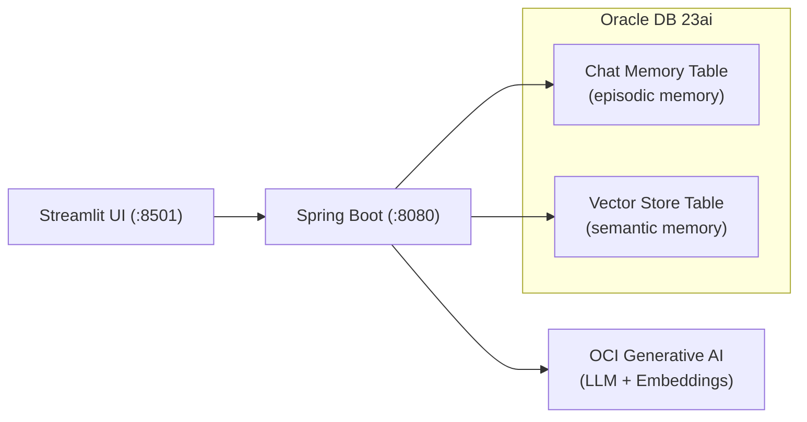

# Oracle Database for Java Agent Memory with Spring AI

POC demonstrating AI agent memory using Spring AI with Oracle Database 23ai. The agent has two memory layers: episodic memory (chat history persisted via JDBC) and semantic memory (domain knowledge retrieved via Oracle AI Vector Search).

## Architecture



## Prerequisites

- Java 21+
- Python 3.9+
- Podman or Docker
- OCI account with access to Generative AI

## Quick Start

### 1. Start Oracle Database

```bash
podman run -d --name oradb \
  -p 1521:1521 \
  -e ORACLE_PWD=Oracle123 \
  -v ./oradata:/opt/oracle/oradata \
  container-registry.oracle.com/database/free:latest
```

Wait for the database to be ready:

```bash
podman logs -f oradb
# Wait for "DATABASE IS READY TO USE!"
```

### 2. Set OCI environment variables

```bash
export OCI_GENAI_MODEL=<your-model-ocid>
export OCI_COMPARTMENT=<your-compartment-ocid>
```

These are the only required env vars when using the `local` profile. OCI auth defaults to `~/.oci/config` with the `DEFAULT` profile.

### 3. Start the Chat Server

```bash
cd src/chatserver
./gradlew bootRun --args='--spring.profiles.active=local'
```

The local profile uses the `PDBADMIN` user that already exists in the Oracle Free container -- no database setup needed.

### 4. Start the Web UI

```bash
cd src/web
pip install -r requirements.txt
streamlit run app.py
```

Opens on `http://localhost:8501`.

### 5. Test with curl

Chat (with conversation memory):

```bash
curl -X POST http://localhost:8080/api/v1/agent/chat \
  -H "Content-Type: text/plain" \
  -H "X-Conversation-Id: test-1" \
  -d "Hello, what can you help me with?"
```

Add knowledge (for RAG retrieval):

```bash
curl -X POST http://localhost:8080/api/v1/agent/knowledge \
  -H "Content-Type: text/plain" \
  -d "Oracle Database 23ai supports native VECTOR data type for AI workloads."
```

## API Reference

### POST /api/v1/agent/chat

Chat with the agent. Supports episodic memory (conversation history) and semantic memory (RAG from knowledge base).

- **Body:** plain text message (max 10,000 chars)
- **Headers:** `Content-Type: text/plain`, `X-Conversation-Id: <id>`
- **Response:** plain text

### POST /api/v1/agent/knowledge

Add domain knowledge to the vector store for RAG retrieval.

- **Body:** plain text content (max 50,000 chars)
- **Headers:** `Content-Type: text/plain`
- **Response:** confirmation message

## Environment Variables

### Required

| Variable          | Description               |
| ----------------- | ------------------------- |
| `OCI_GENAI_MODEL` | OCI GenAI chat model OCID |
| `OCI_COMPARTMENT` | OCI compartment OCID      |

When **not** using the `local` profile, also set:

| Variable      | Description             |
| ------------- | ----------------------- |
| `DB_PASSWORD` | Oracle Database password |

### Optional (with defaults)

| Variable              | Default                                       | Description                          |
| --------------------- | --------------------------------------------- | ------------------------------------ |
| `DB_URL`              | `jdbc:oracle:thin:@//localhost:1521/freepdb1` | JDBC connection URL                  |
| `DB_USERNAME`         | `spring_ai_user`                              | Database username                    |
| `OCI_REGION`          | `us-chicago-1`                                | OCI region                           |
| `OCI_AUTH_TYPE`       | `file`                                        | OCI authentication type              |
| `OCI_CONFIG_FILE`     | `~/.oci/config`                               | Path to OCI config file              |
| `OCI_PROFILE`         | `DEFAULT`                                     | OCI config profile                   |
| `OCI_EMBEDDING_MODEL` | `cohere.embed-english-light-v2.0`             | OCI embedding model for vector store |
| `BACKEND_URL`         | `http://localhost:8080`                       | Backend URL (Web UI only)            |

## Cleanup

```bash
podman rm -f oradb
rm -rf ./oradata
```
