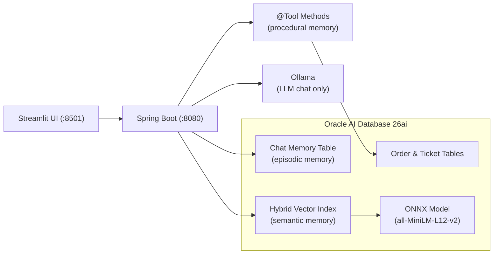
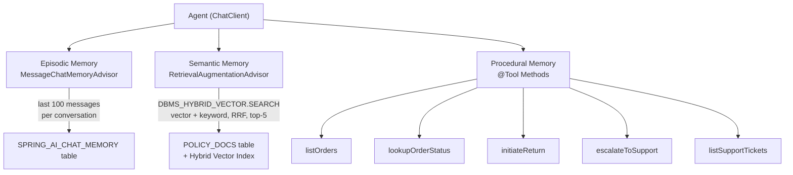
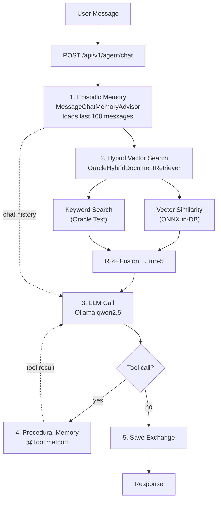

# Oracle Database for Java Agent Memory with Spring AI

POC demonstrating AI agent memory using Spring AI with Oracle AI Database 26ai. The agent has three memory layers: episodic memory (chat history persisted via JDBC), semantic memory (domain knowledge retrieved via Oracle Hybrid Vector Search — vector similarity + keyword search fused with Reciprocal Rank Fusion), and procedural memory (DB-backed `@Tool`-annotated methods the LLM can call to perform actions). Embeddings are computed in-database using a loaded ONNX model. Demo data (8 orders + 12 policy documents) is auto-seeded on startup for a complete end-to-end demo flow.

## Architecture



### Memory Layers



### Query Flow



## Prerequisites

- Java 21+
- Python 3.9+
- Podman or Docker
- [Ollama](https://ollama.com/) installed locally

## Quick Start

### 1. Start Oracle Database

```bash
mkdir -p ./oradata
podman run -d --name oradb \
  -p 1521:1521 \
  -e ORACLE_PWD=Oracle123 \
  -v ./oradata:/opt/oracle/oradata \
  container-registry.oracle.com/database/free:latest
```

Wait for the database to be ready:

```bash
podman logs -f oradb
```

Wait for "DATABASE IS READY TO USE!" in the logs before continuing.

### 2. Grant database privileges

Grants privileges for JPA, ONNX model loading, Oracle Text, and creates the directory for the ONNX model file:

```bash
podman exec -i oradb sqlplus sys/Oracle123@freepdb1 as sysdba < setup-db.sql
```

### 3. Set up hybrid vector search

Load the ONNX embedding model into Oracle and create the hybrid vector index. This is a one-time setup.

Download the pre-built `all-MiniLM-L12-v2` ONNX model from [Oracle ML](https://blogs.oracle.com/machinelearning/use-our-prebuilt-onnx-model-now-available-for-embedding-generation-in-oracle-database-23ai), then:

```bash
podman exec oradb mkdir -p /opt/oracle/dumps
podman cp all_MiniLM_L12_v2.onnx oradb:/opt/oracle/dumps/
podman exec -i oradb sqlplus pdbadmin/Oracle123@freepdb1 < setup-hybrid-search.sql
```

This loads the ONNX model into the database, creates the `POLICY_DOCS` table, and creates a hybrid vector index that combines vector similarity search with Oracle Text keyword search.

### 4. Install Ollama, start the server, and pull the chat model

```bash
brew install ollama
```

On macOS, `brew install` starts Ollama as a background service automatically. If it's not running, start it manually:

```bash
ollama serve
```

This runs in the foreground on `http://localhost:11434` — open a new terminal for the next steps. If you get `Error: address already in use`, the server is already running — skip this step.

Verify it's running:

```bash
curl -s http://localhost:11434/api/tags | jq .
```

Pull the chat model:

```bash
ollama pull qwen2.5          # chat model with tool calling support
```

> From cURL:
>
> ```bash
> curl -s http://localhost:11434/api/pull -d '{"model": "qwen2.5"}'
> ```

Embeddings are computed in-database by the ONNX model loaded in step 3 — no Ollama embedding model needed.

### 5. Set up the local profile

```bash
cd src/chatserver/src/main/resources
cp application-local.yaml.example application-local.yaml
```

Ollama defaults (`localhost:11434`, `qwen2.5`) are configured in `application.yaml`. The local profile only overrides database credentials and logging.

### 6. Start the Chat Server

```bash
cd src/chatserver
./gradlew bootRun --args='--spring.profiles.active=local'
```

The local profile uses the `PDBADMIN` user that already exists in the Oracle Free container (privileges granted in step 2).

### 7. Start the Web UI

```bash
cd src/web
pip install -r requirements.txt
streamlit run app.py
```

Opens on `http://localhost:8501`.

### 8. Test with curl

Chat (with conversation memory):

```bash
curl -X POST http://localhost:8080/api/v1/agent/chat \
  -H "Content-Type: text/plain" \
  -H "X-Conversation-Id: test-1" \
  -d "What orders do I have?"
```

Ask about policies (semantic memory -- auto-seeded on startup):

```bash
curl -X POST http://localhost:8080/api/v1/agent/chat \
  -H "Content-Type: text/plain" \
  -H "X-Conversation-Id: test-1" \
  -d "What's your return policy?"
```

Use tools (procedural memory):

```bash
curl -X POST http://localhost:8080/api/v1/agent/chat \
  -H "Content-Type: text/plain" \
  -H "X-Conversation-Id: test-1" \
  -d "I want to return order ORD-1001, the product was defective."
```

## API Reference

### POST /api/v1/agent/chat

Chat with the agent. Supports episodic memory (conversation history) and semantic memory (RAG from knowledge base).

- **Body:** plain text message (max 10,000 chars)
- **Headers:** `Content-Type: text/plain`, `X-Conversation-Id: <id>`
- **Response:** plain text

### POST /api/v1/agent/knowledge

Add domain knowledge for RAG retrieval. Text is inserted into the `POLICY_DOCS` table; the hybrid vector index handles embedding automatically.

- **Body:** plain text content (max 50,000 chars)
- **Headers:** `Content-Type: text/plain`
- **Response:** confirmation message

## Environment Variables

When using the `local` profile, Ollama defaults and database credentials are already configured. No env var exports needed.

When **not** using the `local` profile, set:

| Variable      | Description              |
| ------------- | ------------------------ |
| `DB_PASSWORD` | Oracle Database password |

### Optional (with defaults)

| Variable            | Default                                       | Description               |
| ------------------- | --------------------------------------------- | ------------------------- |
| `DB_URL`            | `jdbc:oracle:thin:@//localhost:1521/freepdb1` | JDBC connection URL       |
| `DB_USERNAME`       | `pdbadmin`                                    | Database username         |
| `OLLAMA_BASE_URL`   | `http://localhost:11434`                      | Ollama server URL         |
| `OLLAMA_CHAT_MODEL` | `qwen2.5`                                     | Ollama chat model         |
| `BACKEND_URL`       | `http://localhost:8080`                       | Backend URL (Web UI only) |

## Switching to Other Providers

Spring AI's abstraction layer makes switching the chat model provider a dependency + config change — no Java code changes needed:

| Provider       | Dependency                             | Config prefix            |
| -------------- | -------------------------------------- | ------------------------ |
| Ollama (local) | `spring-ai-starter-model-ollama`       | `spring.ai.ollama`       |
| OpenAI         | `spring-ai-starter-model-openai`       | `spring.ai.openai`       |
| Anthropic      | `spring-ai-starter-model-anthropic`    | `spring.ai.anthropic`    |
| OCI GenAI      | `spring-ai-starter-model-oci-genai`    | `spring.ai.oci.genai`    |
| GCP Vertex AI  | `spring-ai-starter-model-vertex-ai`    | `spring.ai.vertex.ai`    |
| Azure OpenAI   | `spring-ai-starter-model-azure-openai` | `spring.ai.azure.openai` |

Only `build.gradle` dependency and `application.yaml` config need to change. Embeddings are handled in-database by the ONNX model and are not affected by the chat provider choice.

## Cleanup

### Oracle Database

```bash
podman rm -f oradb
rm -rf ./oradata
```

### Ollama

Delete the pulled model:

```bash
ollama rm qwen2.5
```

Press Ctrl+C to stop the Ollama server
