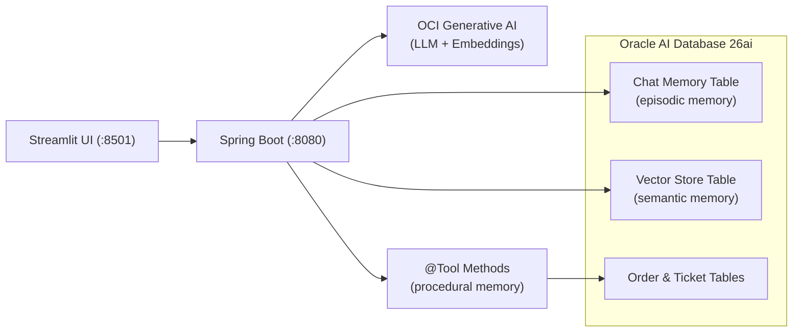
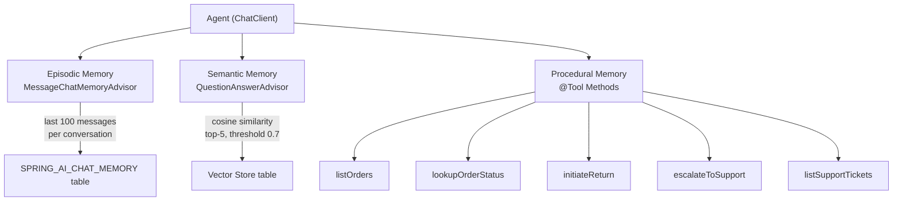

# Oracle Database for Java Agent Memory with Spring AI

POC demonstrating AI agent memory using Spring AI with Oracle AI Database 26ai. The agent has three memory layers: episodic memory (chat history persisted via JDBC), semantic memory (domain knowledge retrieved via Oracle AI Vector Search), and procedural memory (DB-backed `@Tool`-annotated methods the LLM can call to perform actions). Demo data (8 orders + 3 policy documents) is auto-seeded on startup for a complete end-to-end demo flow.

## Architecture



### Memory Layers



## Prerequisites

- Java 21+
- Python 3.9+
- Podman or Docker
- OCI account with access to Generative AI

## Quick Start

### 1. Start Oracle Database

```bash
mkdir -p ./oradata
podman run -d --name oradb \
  -p 1521:1521 \
  -e ORACLE_PWD=Oracle123 \
  -v ./oradata:/opt/oracle/oradata \
  container-registry.oracle.com/database/free:latest
```

Wait for the database to be ready:

```bash
podman logs -f oradb
```

Wait for "DATABASE IS READY TO USE!" in the logs before continuing.

### 2. Grant database privileges

The `PDBADMIN` user needs `CREATE TABLE` privileges to allow Spring Boot to auto-create tables on startup:

```bash
podman exec -i oradb sqlplus sys/Oracle123@freepdb1 as sysdba < setup-db.sql
```

### 3. Set up the local profile

```bash
cd src/chatserver/src/main/resources
cp application-local.yaml.example application-local.yaml
```

Edit `application-local.yaml` and fill in your OCI GenAI model OCID and compartment OCID. You can retrieve them with the OCI CLI:

```bash
# Get your compartment OCID (replace "MyCompartment" with your compartment name)
oci iam compartment list --name "MyCompartment" --compartment-id-in-subtree true \
  --query "data[0].id" --raw-output

# List available GenAI chat models in your compartment
oci generative-ai model-collection list-models \
  --compartment-id <your-compartment-ocid> \
  --capability CHAT \
  --query "data.items[].{name:\"display-name\", id:id}"

# List available embedding models in your compartment
oci generative-ai model-collection list-models \
  --compartment-id <your-compartment-ocid> \
  --capability TEXT_EMBEDDINGS \
  --query "data.items[].{name:\"display-name\", id:id}"
```

OCI auth defaults to `~/.oci/config` with the `DEFAULT` profile.

### 4. Start the Chat Server

```bash
cd src/chatserver
./gradlew bootRun --args='--spring.profiles.active=local'
```

The local profile uses the `PDBADMIN` user that already exists in the Oracle Free container (privileges granted in step 2).

### 5. Start the Web UI

```bash
cd src/web
pip install -r requirements.txt
streamlit run app.py
```

Opens on `http://localhost:8501`.

### 6. Test with curl

Chat (with conversation memory):

```bash
curl -X POST http://localhost:8080/api/v1/agent/chat \
  -H "Content-Type: text/plain" \
  -H "X-Conversation-Id: test-1" \
  -d "What orders do I have?"
```

Ask about policies (semantic memory -- auto-seeded on startup):

```bash
curl -X POST http://localhost:8080/api/v1/agent/chat \
  -H "Content-Type: text/plain" \
  -H "X-Conversation-Id: test-1" \
  -d "What's your return policy?"
```

Use tools (procedural memory):

```bash
curl -X POST http://localhost:8080/api/v1/agent/chat \
  -H "Content-Type: text/plain" \
  -H "X-Conversation-Id: test-1" \
  -d "I want to return order ORD-1001, the product was defective."
```

Add custom knowledge (for RAG retrieval):

```bash
curl -X POST http://localhost:8080/api/v1/agent/knowledge \
  -H "Content-Type: text/plain" \
  -d "Oracle AI Database 26ai supports native VECTOR data type for AI workloads."
```

## API Reference

### POST /api/v1/agent/chat

Chat with the agent. Supports episodic memory (conversation history) and semantic memory (RAG from knowledge base).

- **Body:** plain text message (max 10,000 chars)
- **Headers:** `Content-Type: text/plain`, `X-Conversation-Id: <id>`
- **Response:** plain text

### POST /api/v1/agent/knowledge

Add domain knowledge to the vector store for RAG retrieval.

- **Body:** plain text content (max 50,000 chars)
- **Headers:** `Content-Type: text/plain`
- **Response:** confirmation message

## Environment Variables

When using the `local` profile, OCI model and compartment are configured in `application-local.yaml` (see Quick Start step 2). No env var exports needed.

When **not** using the `local` profile, set:

| Variable          | Description               |
| ----------------- | ------------------------- |
| `OCI_GENAI_MODEL`    | OCI GenAI chat model OCID          |
| `OCI_COMPARTMENT`    | OCI compartment OCID               |
| `OCI_EMBEDDING_MODEL`| OCI embedding model for vector store|
| `DB_PASSWORD`        | Oracle Database password            |

### Optional (with defaults)

| Variable              | Default                                       | Description                          |
| --------------------- | --------------------------------------------- | ------------------------------------ |
| `DB_URL`              | `jdbc:oracle:thin:@//localhost:1521/freepdb1` | JDBC connection URL                  |
| `DB_USERNAME`         | `pdbadmin`                                    | Database username                    |
| `OCI_REGION`          | `us-chicago-1`                                | OCI region                           |
| `OCI_AUTH_TYPE`       | `file`                                        | OCI authentication type              |
| `OCI_CONFIG_FILE`     | `~/.oci/config`                               | Path to OCI config file              |
| `OCI_PROFILE`         | `DEFAULT`                                     | OCI config profile                   |
| `BACKEND_URL`         | `http://localhost:8080`                       | Backend URL (Web UI only)            |

## Cleanup

```bash
podman rm -f oradb
rm -rf ./oradata
```
