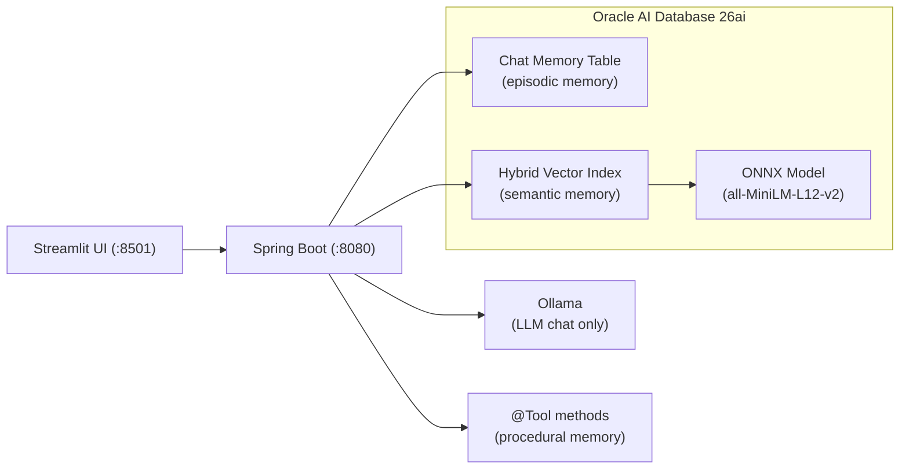
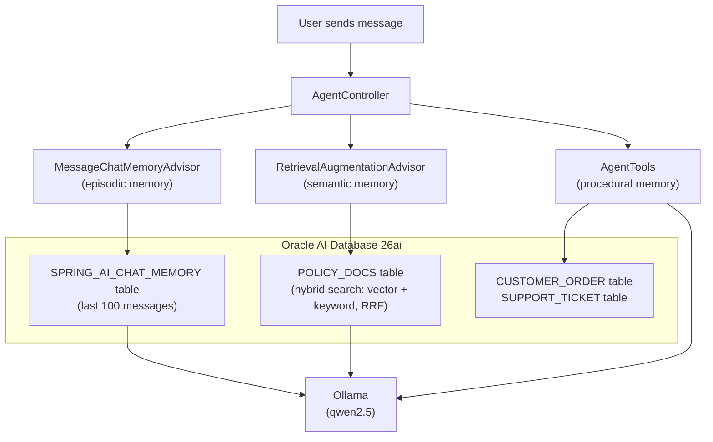
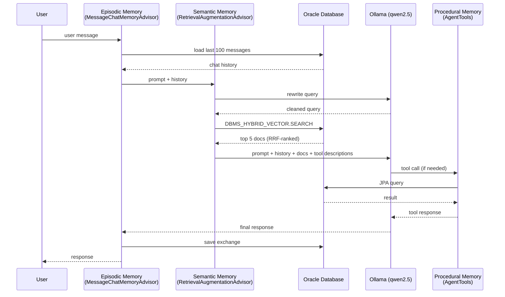

# How I Gave an AI Agent Memory Using Spring AI and Oracle Database

Every LLM has the same problem: it forgets everything the moment the conversation ends. Spend twenty minutes explaining your project setup, your constraints, your preferences -- and it nails the answer. Close the tab, open a new session, and it greets you like a stranger. All that context, gone.

If you want to build an AI _agent_ -- something that actually remembers context and knows things about your domain -- you need to give it memory. The practical kind, where it actually remembers what you said and can look up facts you taught it.

This is a POC I built to do exactly that. Three types of memory, one database, not much code. The complete source code is available on [GitHub](https://github.com/victormartin/oracle-database-java-agent-memory).

## The Architecture



The stack:

- **Spring Boot 3.5.11** + **Spring AI 1.1.2** for the backend
- **Ollama** for chat inference (qwen2.5), running locally
- **Oracle AI Database 26ai** for all three memory stores, with Hybrid Vector Indexes (vector + keyword search fused with RRF) for semantic retrieval and a loaded ONNX model (all-MiniLM-L12-v2) for in-database embeddings
- **Streamlit** for a quick-and-dirty web UI (~100 lines of Python)
- **Java 21**, **Gradle 8.14**

## Three Kinds of Memory

People talk about episodic, semantic, procedural, and working memory for agents. Working memory is just the LLM's context window -- the active "scratchpad" for the current request. It's not persisted, so there's nothing to build. I implemented the other three:

**Episodic memory** is chat history. The agent remembers what you said earlier in the conversation. "My name is Victor" at message 1 means it still knows your name at message 50. This is stored as rows in a relational table.


**Semantic memory** is domain knowledge. You feed the agent facts -- product docs, company policies, whatever -- and it retrieves relevant ones when answering questions. This is RAG (Retrieval-Augmented Generation): text gets converted into dense vectors (embeddings) that map meaning into geometric space, so semantically similar text lands near each other. At query time, the system searches for vectors close to the user's question and injects the matching documents into the LLM prompt. In this POC, embeddings are computed in-database by an ONNX model (all-MiniLM-L12-v2, 384 dimensions) loaded directly into Oracle -- no external embedding API calls.


**Procedural memory** is the "how" -- the step-by-step workflows the agent knows how to execute. Looking up an order, initiating a return, escalating to support. In Spring AI, these are `@Tool`-annotated methods that the LLM can call when it decides a task requires action, not just an answer.




Both tables live in the same Oracle Database. No Pinecone. No Redis. No second database. One connection pool, one set of credentials, one thing to monitor.

## The Procedural Memory (Tools)

Procedural memory is implemented as `@Tool`-annotated methods in a Spring component that query real database tables. Here are two representative methods, simplified for clarity -- the full class has five tools total (see [`AgentTools.java`](https://github.com/victormartin/oracle-database-java-agent-memory/blob/main/src/chatserver/src/main/java/dev/victormartin/agentmemory/chatserver/tools/AgentTools.java)):

```java
@Tool(description = "Look up the status of a customer order by its order ID. " +
        "Returns the current status including shipping information.")
public String lookupOrderStatus(
        @ToolParam(description = "The order ID to look up, e.g. ORD-1001") String orderId) {
    Optional<CustomerOrder> opt = orderRepository.findByOrderId(orderId);
    if (opt.isEmpty()) {
        return "Order %s not found.".formatted(orderId);
    }
    CustomerOrder o = opt.get();
    return "Order %s: %s | Qty: %d | $%s | Status: %s | Purchased: %s | Ship to: %s"
            .formatted(o.getOrderId(), o.getProductName(), o.getQuantity(),
                    o.getTotalAmount(), o.getStatus(), o.getPurchaseDate(), o.getShippingAddress());
}

@Tool(description = "Initiate a product return for a given order. " +
        "Validates the order exists, checks that it is in DELIVERED status, " +
        "and verifies the return is within the 30-day return window.")
public String initiateReturn(
        @ToolParam(description = "The order ID to return") String orderId,
        @ToolParam(description = "The reason for the return") String reason) {
    Optional<CustomerOrder> opt = orderRepository.findByOrderId(orderId);
    if (opt.isEmpty()) {
        return "Order %s not found. Cannot initiate return.".formatted(orderId);
    }
    CustomerOrder order = opt.get();

    if (order.getStatus() != OrderStatus.DELIVERED) {
        return "Order %s cannot be returned. Current status is %s — only DELIVERED orders are eligible."
                .formatted(orderId, order.getStatus());
    }

    long daysSincePurchase = ChronoUnit.DAYS.between(order.getPurchaseDate(), LocalDate.now());
    if (daysSincePurchase > RETURN_WINDOW_DAYS) {
        return "Order %s cannot be returned. Purchased %d days ago, exceeds the %d-day window."
                .formatted(orderId, daysSincePurchase, RETURN_WINDOW_DAYS);
    }

    order.setStatus(OrderStatus.PREPARING_RETURN);
    orderRepository.save(order);
    return "Return initiated for order %s (%s). Reason: %s. Status changed to PREPARING_RETURN."
            .formatted(orderId, order.getProductName(), reason);
}
```

The `@Tool` description tells the LLM _when_ to use each method, and `@ToolParam` describes the arguments. When the user says "I want to return order ORD-1001," the LLM reads the tool descriptions, decides `initiateReturn` is the right procedure, extracts the arguments from the conversation, calls the method, and incorporates the result into its response.

The other three tools are `listOrders`, `escalateToSupport`, and `listSupportTickets`. They follow the same pattern: JPA repositories backed by Oracle Database tables. The LLM decides _when_ to act; the Java methods define _how_.

## The Controller

The controller wires everything together -- two advisors, five tools, one `ChatClient`. Here's the core of it, simplified for clarity (the full version adds input validation and error handling -- see [`AgentController.java`](https://github.com/victormartin/oracle-database-java-agent-memory/blob/main/src/chatserver/src/main/java/dev/victormartin/agentmemory/chatserver/controller/AgentController.java)):

```java
@RestController
@RequestMapping("/api/v1/agent")
public class AgentController {

    private final ChatClient chatClient;
    private final JdbcTemplate jdbcTemplate;

    public AgentController(ChatClient.Builder builder,
                           JdbcChatMemoryRepository chatMemoryRepository,
                           JdbcTemplate jdbcTemplate,
                           AgentTools agentTools) {
        this.jdbcTemplate = jdbcTemplate;

        ChatMemory chatMemory = MessageWindowChatMemory.builder()
                .chatMemoryRepository(chatMemoryRepository)
                .maxMessages(100)
                .build();

        var hybridRetriever = new OracleHybridDocumentRetriever(
                jdbcTemplate, 5, "POLICY_HYBRID_IDX", "rrf");

        QueryTransformer queryTransformer = RewriteQueryTransformer.builder()
                .chatClientBuilder(builder.build().mutate())
                .targetSearchSystem("Oracle hybrid vector search over policy documents")
                .build();

        this.chatClient = builder
                .defaultSystem("""
                        You are a helpful AI assistant with access to a knowledge base \
                        and a set of tools for performing tasks. ...""")
                .defaultTools(agentTools)
                .defaultAdvisors(
                        MessageChatMemoryAdvisor.builder(chatMemory).build(),
                        RetrievalAugmentationAdvisor.builder()
                                .documentRetriever(hybridRetriever)
                                .queryTransformers(queryTransformer)
                                .build()
                )
                .build();
    }

    @PostMapping("/chat")
    public ResponseEntity<String> chat(
            @RequestBody String message,
            @RequestHeader("X-Conversation-Id") String conversationId) {
        String response = chatClient.prompt()
                .user(message)
                .advisors(a -> a.param(ChatMemory.CONVERSATION_ID, conversationId))
                .call()
                .content();
        return ResponseEntity.ok(response);
    }

    @PostMapping("/knowledge")
    public ResponseEntity<String> addKnowledge(@RequestBody String content) {
        jdbcTemplate.update(
                "INSERT INTO POLICY_DOCS (id, content) VALUES (sys_guid(), ?)",
                content);
        return ResponseEntity.ok("Knowledge added.");
    }
}
```

Two endpoints, two advisors, a query transformer, five tools, one `ChatClient`. Let's break down the three memory types.

### Episodic Memory (Advisors)

Spring AI's advisor pattern is where the magic lives. Advisors intercept every call to the LLM and can modify the prompt before it goes out and process the response when it comes back.

**`MessageChatMemoryAdvisor`** handles episodic memory. Before each LLM call, it loads the last 100 messages for the current conversation from the `SPRING_AI_CHAT_MEMORY` table and prepends them to the prompt. After the response, it saves the new exchange. The conversation is identified by the `X-Conversation-Id` header -- different ID, different memory.

### Semantic Memory (RAG)

**`RetrievalAugmentationAdvisor`** handles semantic memory. Before each LLM call, the user's question first passes through a `RewriteQueryTransformer` that uses the LLM to clean up typos and abbreviations (so "retrun polcy" becomes a proper search query). Then a custom `OracleHybridDocumentRetriever` calls `DBMS_HYBRID_VECTOR.SEARCH`, which runs vector similarity search and Oracle Text keyword/fuzzy search in parallel and fuses the results with Reciprocal Rank Fusion (RRF). The top 5 matching documents get injected into the prompt as context.

Why hybrid instead of pure vector search? Dense embeddings capture meaning -- a query about "return policy" will match documents about refunds and exchanges even if those exact words don't appear. But they're weak on exact terms: a query for "ORD-1001" or a misspelled "retrun polcy" degrades because the embedding model encodes semantics, not keywords. Hybrid search covers both: the vector side handles meaning, the keyword side handles exact matches and fuzzy terms, and RRF merges the two result lists by rank position rather than trying to normalize incompatible scores.

### Procedural Memory (Tools)

**`AgentTools`** handles procedural memory. The `.defaultTools(agentTools)` call registers all five `@Tool`-annotated methods from the component. On every request, the LLM receives the tool descriptions alongside the user's message. If the task requires action -- not just knowledge retrieval -- the LLM calls the appropriate tool, gets the result, and weaves it into its response. Spring AI handles the tool-calling protocol automatically.

All three memory types run on every request. The agent simultaneously remembers what you said, looks up relevant knowledge, and knows how to perform tasks.



### The Knowledge Endpoint

The `/knowledge` endpoint is simple: POST some text, it gets inserted into the `POLICY_DOCS` table via JDBC. The hybrid vector index handles embedding automatically using the in-database ONNX model -- no external embedding API call needed. Next time someone asks a related question, the hybrid search will find it.

### Seed Data

A `DataSeeder` (Spring `CommandLineRunner`) populates the database on startup with 8 demo orders and 12 policy documents (return, shipping, support, warranty, payment, cancellation, exchange, international shipping, privacy, promotions, product guarantee, and bulk order policies). The policies are loaded from a `policies.json` resource file and inserted into the `POLICY_DOCS` table via JDBC. Orders use relative dates so the 30-day return window logic always works for demo purposes. The seeder checks existing counts to avoid duplicates on restarts.

## Upgrading Semantic Memory: Hybrid Search

The first version of this POC used Spring AI's `QuestionAnswerAdvisor` with `OracleVectorStore` -- pure vector similarity search with a cosine threshold. It worked for clean, well-phrased questions about policies. But it fell apart on exact terms and typos. A query for "order ORD-1001" would try to match semantically against policy documents, which makes no sense. A misspelled "retrun polcy" would lose similarity score because the embedding model doesn't know it's a typo.

### Oracle Hybrid Vector Indexes

Oracle 26ai provides `DBMS_HYBRID_VECTOR.SEARCH` -- a single PL/SQL call that runs vector similarity search and Oracle Text keyword search in parallel, then fuses the results. The key insight is Reciprocal Rank Fusion (RRF): instead of trying to normalize cosine similarity scores (bounded 0-1) against BM25 keyword scores (unbounded), it ranks documents by their position in each result list. A document that's #1 in vector results and #3 in keyword results gets a combined rank that reflects both signals.

The setup is a one-time SQL script that loads an ONNX embedding model into Oracle and creates a hybrid index:

```sql
-- Load the ONNX model for in-database embeddings
BEGIN
  DBMS_VECTOR.LOAD_ONNX_MODEL(
    directory  => 'DM_DUMP',
    file_name  => 'all_MiniLM_L12_v2.onnx',
    model_name => 'ALL_MINILM_L12_V2'
  );
END;
/

-- Create a hybrid index: vector similarity + Oracle Text keyword search
CREATE HYBRID VECTOR INDEX POLICY_HYBRID_IDX
ON POLICY_DOCS(content)
PARAMETERS('MODEL ALL_MINILM_L12_V2 VECTOR_IDXTYPE HNSW');
```

Once the index exists, embeddings are computed automatically when rows are inserted -- no external embedding API calls needed.

### Spring AI Integration

Spring AI's `QuestionAnswerAdvisor` only wraps `VectorStore.similaritySearch()` -- pure vector search, nothing else. To use hybrid search, I switched to `RetrievalAugmentationAdvisor`, which is the modular alternative: it accepts a custom `DocumentRetriever`, optional query transformers, and optional post-processors.

The custom `OracleHybridDocumentRetriever` implements `DocumentRetriever` and calls `DBMS_HYBRID_VECTOR.SEARCH` via JDBC, passing a JSON parameter that specifies the hybrid index, the scorer (RRF), and a fuzzy keyword match:

```java
public List<Document> retrieve(Query query) {
    String searchJson = """
        {
          "hybrid_index_name": "POLICY_HYBRID_IDX",
          "search_scorer": "rrf",
          "search_fusion": "UNION",
          "vector": { "search_text": "%s" },
          "text": { "contains": "FUZZY(%s, 70, 6)" },
          "return": { "values": ["chunk_text", "score", "vector_score", "text_score"], "topN": 5 }
        }
        """.formatted(query.text(), query.text());

    String resultJson = jdbcTemplate.queryForObject(
            "SELECT DBMS_HYBRID_VECTOR.SEARCH(JSON(?)) FROM DUAL",
            String.class, searchJson);

    // parse JSON array → List<Document> with score metadata
    return parseResults(resultJson);
}
```

This bypasses `OracleVectorStore` entirely for retrieval. The `RewriteQueryTransformer` cleans up the user's query before it reaches the retriever, so typos and abbreviations get fixed by the LLM before the search runs.

### Why It Matters

The agent needs accurate retrieval to make good decisions. If the semantic memory returns wrong or low-confidence policy documents, the LLM may hallucinate tool parameters or skip calling a tool it should have used. Hybrid search means higher-confidence context, which means better autonomous decisions -- the agent is less likely to misquote a policy or miss a relevant document when both meaning and exact terms are matched.

## The Configuration

Configuration lives in a single `application.yaml`. The key design decisions: Hibernate auto-creates the JPA tables (`ddl-auto: update`), Spring AI auto-creates the chat memory table (`initialize-schema: always`), the `POLICY_DOCS` table and hybrid vector index are created by a one-time SQL script (`setup-hybrid-search.sql`), and Oracle UCP shares one connection pool across all three memory types. No Flyway, no custom `@Configuration` classes -- Spring AI's auto-configuration detects the Oracle JDBC driver and wires everything up. See the full [`application.yaml`](https://github.com/victormartin/oracle-database-java-agent-memory/blob/main/src/chatserver/src/main/resources/application.yaml) in the repo.

## The Web UI

The Streamlit frontend sends messages to the backend and renders responses. Here's the core of it (the full app includes quick-start buttons and a new conversation feature -- see [`app.py`](https://github.com/victormartin/oracle-database-java-agent-memory/blob/main/src/web/app.py)):

```python
def send_message(prompt, url):
    st.session_state.messages.append({"role": "user", "content": prompt})
    with st.chat_message("user"):
        st.markdown(prompt)

    with st.chat_message("assistant"):
        with st.spinner("Thinking..."):
            resp = requests.post(
                f"{url.rstrip('/')}/api/v1/agent/chat",
                data=prompt,
                headers={
                    "Content-Type": "text/plain",
                    "X-Conversation-Id": st.session_state.conversation_id,
                },
                timeout=120,
            )
            resp.raise_for_status()
            answer = resp.text
        st.markdown(answer)
    st.session_state.messages.append({"role": "assistant", "content": answer})

if prompt := st.chat_input("Type a message..."):
    send_message(prompt, backend_url)
```

It generates a UUID per session for the conversation ID, sends plain text to the backend, and renders the response. That's it.

## Running It Yourself

The short version: start an Oracle DB container, load the ONNX model and create the hybrid index (one-time setup), install Ollama and pull the chat model (`qwen2.5`), run the Spring Boot backend with the `local` profile, and optionally start the Streamlit UI. Embeddings are handled in-database by the ONNX model -- no Ollama embedding model needed. Full setup instructions are in the [repo README](https://github.com/victormartin/oracle-database-java-agent-memory).

Quick test with curl:

```bash
curl -X POST http://localhost:8080/api/v1/agent/chat \
  -H "Content-Type: text/plain" \
  -H "X-Conversation-Id: test-1" \
  -d "What orders do I have?"
```

## What This Is (and Isn't)

This is a proof of concept. It demonstrates that you can give an AI agent three types of persistent memory using Spring AI and Oracle Database with very little code. Two advisors handle episodic and semantic memory; `@Tool` methods handle procedural memory.

What it isn't:

- **Not production-hardened.** There's no authentication, no rate limiting, no streaming responses.
- **Not Oracle-exclusive.** Spring AI's abstractions are vendor-neutral for episodic and procedural memory. The hybrid search retriever is Oracle-specific (it calls `DBMS_HYBRID_VECTOR.SEARCH`), but `RetrievalAugmentationAdvisor` accepts any `DocumentRetriever` implementation, so you could write one for PostgreSQL + pg_trgm or Elasticsearch. Oracle is what I used because it handles the relational chat history, the hybrid vector index, and the order/ticket tables all in one database.

The whole point is that agent memory doesn't have to be complicated. Two advisors, a query transformer, five tools backed by real database tables, seed data, one database, and the LLM stops forgetting.

---

**Stack:** Spring Boot 3.5.11 | Spring AI 1.1.2 | Java 21 | Oracle AI Database 26ai (Hybrid Vector Indexes) | Ollama | Streamlit

**Code:** [github.com/victormartin/oracle-database-java-agent-memory](https://github.com/victormartin/oracle-database-java-agent-memory)
