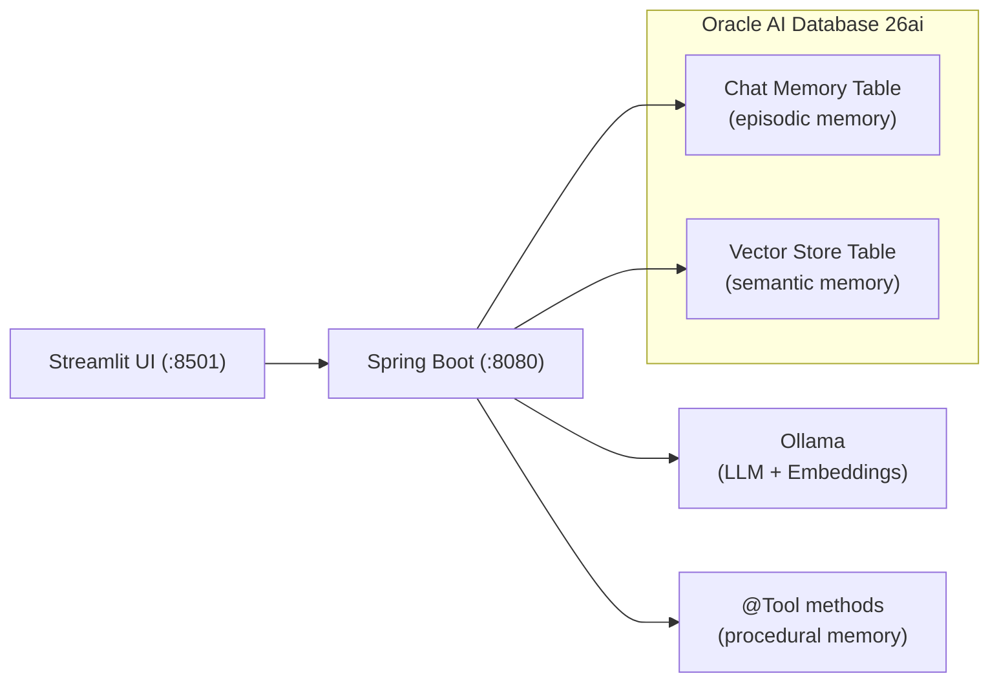
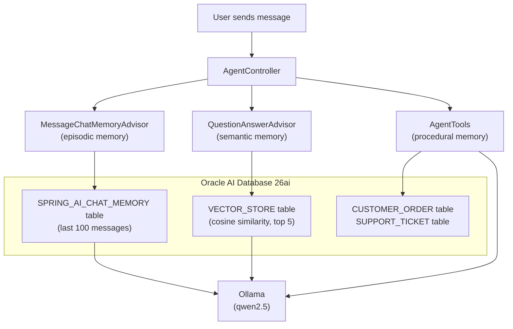

# How I Gave an AI Agent Memory Using Spring AI and Oracle Database

Every LLM has the same problem: it forgets everything the moment the conversation ends. Spend twenty minutes explaining your project setup, your constraints, your preferences -- and it nails the answer. Close the tab, open a new session, and it greets you like a stranger. All that context, gone.

If you want to build an AI _agent_ -- something that actually remembers context and knows things about your domain -- you need to give it memory. The practical kind, where it actually remembers what you said and can look up facts you taught it.

This is a POC I built to do exactly that. Three types of memory, one database, not much code. The complete source code is available on [GitHub](https://github.com/victormartin/oracle-database-java-agent-memory).

## The Architecture



The stack:

- **Spring Boot 3.5.11** + **Spring AI 1.1.2** for the backend
- **Ollama** for chat inference (qwen2.5) and embeddings (nomic-embed-text), running locally
- **Oracle AI Database 26ai** for both memory tables (with Oracle AI Vector Search for the semantic side)
- **Streamlit** for a quick-and-dirty web UI (~100 lines of Python)
- **Java 21**, **Gradle 8.14**

## Three Kinds of Memory

People talk about episodic, semantic, procedural, and working memory for agents. Working memory is just the LLM's context window -- the active "scratchpad" for the current request. It's not persisted, so there's nothing to build. I implemented the other three:

**Episodic memory** is chat history. The agent remembers what you said earlier in the conversation. "My name is Victor" at message 1 means it still knows your name at message 50. This is stored as rows in a relational table.


**Semantic memory** is domain knowledge. You feed the agent facts -- product docs, company policies, whatever -- and it retrieves relevant ones when answering questions. This is RAG (Retrieval-Augmented Generation): text gets embedded into vectors, stored in a vector store, and retrieved by similarity search at query time.


**Procedural memory** is the "how" -- the step-by-step workflows the agent knows how to execute. Looking up an order, initiating a return, escalating to support. In Spring AI, these are `@Tool`-annotated methods that the LLM can call when it decides a task requires action, not just an answer.




Both tables live in the same Oracle Database. No Pinecone. No Redis. No second database. One connection pool, one set of credentials, one thing to monitor.

## The Procedural Memory (Tools)

Procedural memory is implemented as `@Tool`-annotated methods in a Spring component that query real database tables. Here are two representative methods, simplified for clarity -- the full class has five tools total (see [`AgentTools.java`](https://github.com/victormartin/oracle-database-java-agent-memory/blob/main/src/chatserver/src/main/java/dev/victormartin/agentmemory/chatserver/tools/AgentTools.java)):

```java
@Tool(description = "Look up the status of a customer order by its order ID. " +
        "Returns the current status including shipping information.")
public String lookupOrderStatus(
        @ToolParam(description = "The order ID to look up, e.g. ORD-1001") String orderId) {
    Optional<CustomerOrder> opt = orderRepository.findByOrderId(orderId);
    if (opt.isEmpty()) {
        return "Order %s not found.".formatted(orderId);
    }
    CustomerOrder o = opt.get();
    return "Order %s: %s | Qty: %d | $%s | Status: %s | Purchased: %s | Ship to: %s"
            .formatted(o.getOrderId(), o.getProductName(), o.getQuantity(),
                    o.getTotalAmount(), o.getStatus(), o.getPurchaseDate(), o.getShippingAddress());
}

@Tool(description = "Initiate a product return for a given order. " +
        "Validates the order exists, checks that it is in DELIVERED status, " +
        "and verifies the return is within the 30-day return window.")
public String initiateReturn(
        @ToolParam(description = "The order ID to return") String orderId,
        @ToolParam(description = "The reason for the return") String reason) {
    Optional<CustomerOrder> opt = orderRepository.findByOrderId(orderId);
    if (opt.isEmpty()) {
        return "Order %s not found. Cannot initiate return.".formatted(orderId);
    }
    CustomerOrder order = opt.get();

    if (order.getStatus() != OrderStatus.DELIVERED) {
        return "Order %s cannot be returned. Current status is %s — only DELIVERED orders are eligible."
                .formatted(orderId, order.getStatus());
    }

    long daysSincePurchase = ChronoUnit.DAYS.between(order.getPurchaseDate(), LocalDate.now());
    if (daysSincePurchase > RETURN_WINDOW_DAYS) {
        return "Order %s cannot be returned. Purchased %d days ago, exceeds the %d-day window."
                .formatted(orderId, daysSincePurchase, RETURN_WINDOW_DAYS);
    }

    order.setStatus(OrderStatus.PREPARING_RETURN);
    orderRepository.save(order);
    return "Return initiated for order %s (%s). Reason: %s. Status changed to PREPARING_RETURN."
            .formatted(orderId, order.getProductName(), reason);
}
```

The `@Tool` description tells the LLM _when_ to use each method, and `@ToolParam` describes the arguments. When the user says "I want to return order ORD-1001," the LLM reads the tool descriptions, decides `initiateReturn` is the right procedure, extracts the arguments from the conversation, calls the method, and incorporates the result into its response.

The other three tools are `listOrders`, `escalateToSupport`, and `listSupportTickets`. They follow the same pattern: JPA repositories backed by Oracle Database tables. The LLM decides _when_ to act; the Java methods define _how_.

## The Controller

The controller wires everything together -- two advisors, five tools, one `ChatClient`. Here's the core of it, simplified for clarity (the full version adds input validation and error handling -- see [`AgentController.java`](https://github.com/victormartin/oracle-database-java-agent-memory/blob/main/src/chatserver/src/main/java/dev/victormartin/agentmemory/chatserver/controller/AgentController.java)):

```java
@RestController
@RequestMapping("/api/v1/agent")
public class AgentController {

    private final ChatClient chatClient;
    private final VectorStore vectorStore;

    public AgentController(ChatClient.Builder builder,
                           JdbcChatMemoryRepository chatMemoryRepository,
                           VectorStore vectorStore,
                           AgentTools agentTools) {
        this.vectorStore = vectorStore;

        ChatMemory chatMemory = MessageWindowChatMemory.builder()
                .chatMemoryRepository(chatMemoryRepository)
                .maxMessages(100)
                .build();

        this.chatClient = builder
                .defaultSystem("""
                        You are a helpful AI assistant with access to a knowledge base \
                        and a set of tools for performing tasks. ...""")
                .defaultTools(agentTools)
                .defaultAdvisors(
                        MessageChatMemoryAdvisor.builder(chatMemory).build(),
                        QuestionAnswerAdvisor.builder(vectorStore)
                                .searchRequest(SearchRequest.builder()
                                        .topK(5)
                                        .similarityThreshold(0.7)
                                        .build())
                                .build()
                )
                .build();
    }

    @PostMapping("/chat")
    public ResponseEntity<String> chat(
            @RequestBody String message,
            @RequestHeader("X-Conversation-Id") String conversationId) {
        String response = chatClient.prompt()
                .user(message)
                .advisors(a -> a.param(ChatMemory.CONVERSATION_ID, conversationId))
                .call()
                .content();
        return ResponseEntity.ok(response);
    }

    @PostMapping("/knowledge")
    public ResponseEntity<String> addKnowledge(@RequestBody String content) {
        vectorStore.add(List.of(new Document(content)));
        return ResponseEntity.ok("Knowledge added.");
    }
}
```

Two endpoints, two advisors, five tools, one `ChatClient`. Let's break down the three memory types.

### Episodic Memory (Advisors)

Spring AI's advisor pattern is where the magic lives. Advisors intercept every call to the LLM and can modify the prompt before it goes out and process the response when it comes back.

**`MessageChatMemoryAdvisor`** handles episodic memory. Before each LLM call, it loads the last 100 messages for the current conversation from the `SPRING_AI_CHAT_MEMORY` table and prepends them to the prompt. After the response, it saves the new exchange. The conversation is identified by the `X-Conversation-Id` header -- different ID, different memory.

### Semantic Memory (RAG)

**`QuestionAnswerAdvisor`** handles semantic memory. Before each LLM call, it takes the user's question, runs a cosine similarity search against the vector store (top 5 results, 0.7 threshold), and injects any matching documents into the prompt as context. This is the RAG part -- the agent can answer questions about things you've taught it via the `/knowledge` endpoint.

### Procedural Memory (Tools)

**`AgentTools`** handles procedural memory. The `.defaultTools(agentTools)` call registers all five `@Tool`-annotated methods from the component. On every request, the LLM receives the tool descriptions alongside the user's message. If the task requires action -- not just knowledge retrieval -- the LLM calls the appropriate tool, gets the result, and weaves it into its response. Spring AI handles the tool-calling protocol automatically.

All three memory types run on every request. The agent simultaneously remembers what you said, looks up relevant knowledge, and knows how to perform tasks.

### The Knowledge Endpoint

The `/knowledge` endpoint is simple: POST some text, it gets wrapped in a `Document`, embedded into a vector (via nomic-embed-text through Ollama), and stored in Oracle's vector store table. Next time someone asks a related question, the `QuestionAnswerAdvisor` will find it.

### Seed Data

A `DataSeeder` (Spring `CommandLineRunner`) populates the database on startup with 8 demo orders and 3 policy documents (return, shipping, support policies). Orders use relative dates so the 30-day return window logic always works for demo purposes. The seeder checks if orders already exist to avoid duplicates on restarts.

## The Configuration

Configuration lives in a single `application.yaml`. The key design decisions: Hibernate auto-creates the JPA tables (`ddl-auto: update`), Spring AI auto-creates the chat memory and vector store tables (`initialize-schema: true/always`), and Oracle UCP shares one connection pool across all three memory types. No SQL scripts, no Flyway, no custom `@Configuration` classes -- Spring AI's auto-configuration detects the Oracle JDBC driver and wires everything up. See the full [`application.yaml`](https://github.com/victormartin/oracle-database-java-agent-memory/blob/main/src/chatserver/src/main/resources/application.yaml) in the repo.

## The Web UI

The Streamlit frontend sends messages to the backend and renders responses. Here's the core of it (the full app includes quick-start buttons and a new conversation feature -- see [`app.py`](https://github.com/victormartin/oracle-database-java-agent-memory/blob/main/src/web/app.py)):

```python
def send_message(prompt, url):
    st.session_state.messages.append({"role": "user", "content": prompt})
    with st.chat_message("user"):
        st.markdown(prompt)

    with st.chat_message("assistant"):
        with st.spinner("Thinking..."):
            resp = requests.post(
                f"{url.rstrip('/')}/api/v1/agent/chat",
                data=prompt,
                headers={
                    "Content-Type": "text/plain",
                    "X-Conversation-Id": st.session_state.conversation_id,
                },
                timeout=120,
            )
            resp.raise_for_status()
            answer = resp.text
        st.markdown(answer)
    st.session_state.messages.append({"role": "assistant", "content": answer})

if prompt := st.chat_input("Type a message..."):
    send_message(prompt, backend_url)
```

It generates a UUID per session for the conversation ID, sends plain text to the backend, and renders the response. That's it.

## Running It Yourself

The short version: start an Oracle DB container, install Ollama and pull two models (`qwen2.5` + `nomic-embed-text`), run the Spring Boot backend with the `local` profile, and optionally start the Streamlit UI. Full setup instructions are in the [repo README](https://github.com/victormartin/oracle-database-java-agent-memory).

Quick test with curl:

```bash
curl -X POST http://localhost:8080/api/v1/agent/chat \
  -H "Content-Type: text/plain" \
  -H "X-Conversation-Id: test-1" \
  -d "What orders do I have?"
```

## What This Is (and Isn't)

This is a proof of concept. It demonstrates that you can give an AI agent three types of persistent memory using Spring AI and Oracle Database with very little code. Two advisors handle episodic and semantic memory; `@Tool` methods handle procedural memory.

What it isn't:

- **Not production-hardened.** There's no authentication, no rate limiting, no streaming responses.
- **Not Oracle-exclusive.** Spring AI's abstractions are vendor-neutral. You could swap Oracle for PostgreSQL + pgvector and the controller code wouldn't change. Oracle is what I used because it handles the relational chat history, the vector store, and the order/ticket tables all in one database, and Oracle AI Vector Search works well for this use case.

The whole point is that agent memory doesn't have to be complicated. Two advisors, five tools backed by real database tables, seed data, one database, and the LLM stops forgetting.

---

**Stack:** Spring Boot 3.5.11 | Spring AI 1.1.2 | Java 21 | Oracle AI Database 26ai | Ollama | Streamlit

**Code:** [github.com/victormartin/oracle-database-java-agent-memory](https://github.com/victormartin/oracle-database-java-agent-memory)
