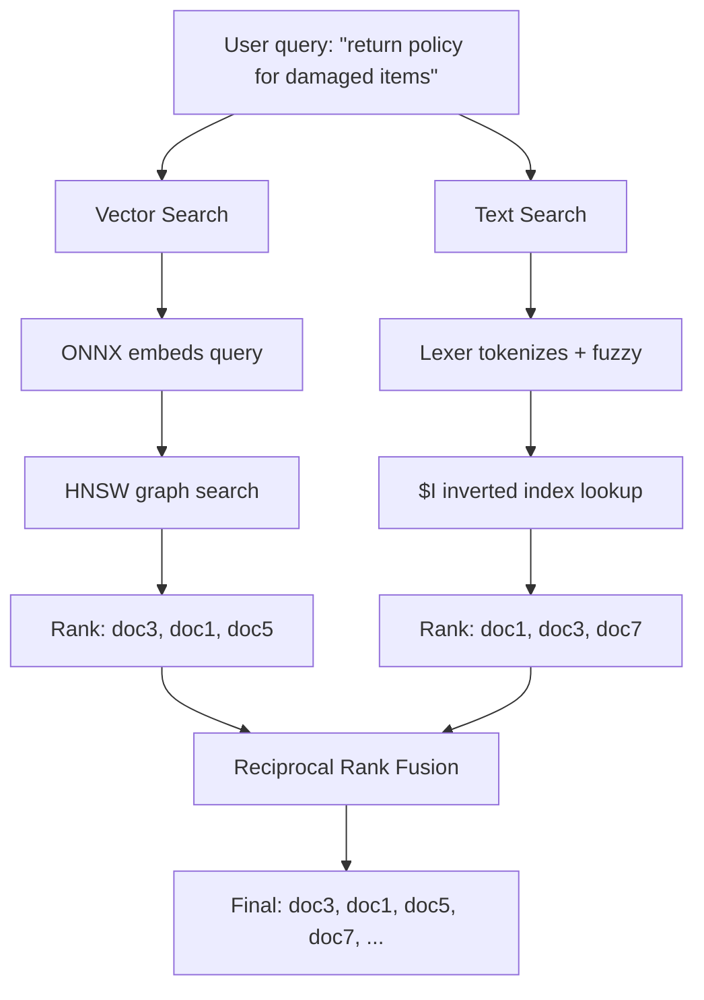

# Oracle Hybrid Vector Index: Why and How It Works

Pure vector search has a blind spot. It's great at understanding meaning —"defective product" matches "broken item" even though they share no words —but it can miss exact keywords that matter. Ask "what's the policy for order ORD-1001?" and vector search might rank a document about "order processing guidelines" higher than one that literally contains "ORD-1001". The embedding model captures the _concept_ of orders but loses the specific identifier.

Pure keyword search has the opposite problem. It finds "ORD-1001" instantly, but ask "how do I send back a damaged item?" and it won't match a document titled "Return Policy" because the words don't overlap.

Neither approach alone is good enough for a RAG pipeline that needs to handle both natural language questions and precise lookups. That's the challenge Oracle's Hybrid Vector Index solves.

## What the Hybrid Vector Index Actually Is

A hybrid vector index is a single Oracle domain index that internally creates and manages **two sub-indexes**:

1. **An HNSW vector index** —for semantic similarity search
2. **An Oracle Text inverted index** —for keyword and fuzzy search

One DDL statement creates both:

```sql
CREATE HYBRID VECTOR INDEX POLICY_HYBRID_IDX
ON POLICY_DOCS(content)
PARAMETERS('MODEL ALL_MINILM_L12_V2 VECTOR_IDXTYPE HNSW');
```

The key detail: the base table (`POLICY_DOCS`) has no vector column. The index computes embeddings automatically using the bound ONNX model and stores them inside its own structures. From the application's perspective, you insert plain text and search with plain text —the database handles embedding, indexing, and fusion internally.

## The Two Sub-Indexes

### HNSW Vector Index

HNSW (Hierarchical Navigable Small World) is an approximate nearest neighbor algorithm. It builds a multi-layered graph:

```
Layer 3 (sparse):    A ---------> D              (few nodes, long jumps)
Layer 2:             A ----> C --> D              (more nodes, medium jumps)
Layer 1:             A -> B -> C -> D -> E        (most nodes, short jumps)
Layer 0 (dense):     A -> B -> C -> D -> E -> F   (all nodes, fine-grained)
```

- Top layers are sparse with long-range connections for fast navigation
- Bottom layers are dense with short-range connections for precision
- Search starts at the top layer, greedily traverses to the nearest neighbor, drops to the next layer, and repeats until the bottom layer yields the final results
- Trade-off: ~95-99% recall, orders of magnitude faster than exact brute-force search

When you search, the query text is embedded using the same ONNX model, then the HNSW graph is traversed to find the closest vectors.

### Oracle Text Inverted Index

This is a classic full-text search index. Oracle Text creates several internal structures (the "dollar tables") in the user's schema:

| Internal Table                                | Purpose                                                                                                                               |
| --------------------------------------------- | ------------------------------------------------------------------------------------------------------------------------------------- |
| `DR$<index_name>$I` (DR = Document Retrieval) | **Main inverted index** —maps each token (word) to a posting list: which documents contain it, at what positions, with what frequency |
| `DR$<index_name>$K`                           | **Key mapping** —maps Oracle Text internal doc IDs to the base table's ROWID                                                          |
| `DR$<index_name>$R`                           | **Reverse mapping** —ROWID to internal doc ID (inverse of $K)                                                                         |
| `DR$<index_name>$N`                           | **Negative list / pending queue** —tracks deleted or updated rows pending index synchronization                                       |

Oracle Text also creates internal sequences, procedures, and triggers for index maintenance and DML tracking.

The inverted index supports:

- **Exact keyword matching**: "return policy" finds documents with those exact words
- **Fuzzy matching**: "retrun polcy" still finds results (Levenshtein distance)
- **Stemming**: "returning" matches "return"
- **Stopword filtering**: Common words like "the", "is" are excluded

## Reciprocal Rank Fusion (RRF)

When you query via `DBMS_HYBRID_VECTOR.SEARCH`, both sub-indexes run **in parallel inside the database**:



RRF merges both ranked lists using a simple formula:

```
RRF_score(doc) = SUM( 1 / (k + rank_in_list_i) )
```

Where `k` is a constant (typically 60). Example for a document ranked 2nd in vector results and 1st in text results:

- Vector contribution: 1/(60+2) = 0.0161
- Text contribution: 1/(60+1) = 0.0164
- RRF score: 0.0325

RRF is elegant because it only uses rank positions, not raw scores. This avoids the problem of normalizing scores across fundamentally different ranking methods (cosine similarity vs. text relevance). A document that appears in both result sets gets boosted; a document that ranks high in only one still appears, but lower.

## What Happens on INSERT

When the Spring Boot `DataSeeder` inserts a policy document:

```sql
INSERT INTO POLICY_DOCS (id, content) VALUES (sys_guid(), ?)
```

The hybrid index intercepts the DML through `CTXSYS.TEXTINDEXMETHODS` (CTXSYS = ConText System, the domain index implementation). Both paths run within the same transaction:

**1. The row is inserted into `POLICY_DOCS`**

**2. Vector path — embedding and HNSW insertion**

The ONNX model (`all-MiniLM-L12-v2`) runs inside the database engine and transforms the text content into a 384-dimensional dense vector — an array of 384 float32 values that encodes the semantic meaning of the text. Sentences with similar meaning produce vectors that are geometrically close to each other (high cosine similarity).

The resulting vector is then inserted into the HNSW graph. HNSW insertion works top-down:

- A random level is assigned to the new node (most nodes only exist at layer 0; a few reach higher layers — this is what keeps upper layers sparse)
- Starting from the topmost layer's entry point, the algorithm greedily navigates to the nearest neighbor at each layer
- At each layer from the assigned level down to layer 0, the new node is connected to its closest neighbors with bidirectional edges
- The number of connections per node is bounded by a parameter `M` (typically 16–64), which controls the trade-off between search accuracy and index size

After insertion, the new document is reachable via graph traversal from any query vector.

**3. Text path — tokenization and inverted index update**

The content is passed through Oracle Text's lexer pipeline:

- **Word boundary detection** — splits the text into individual tokens
- **Case normalization** — lowercases all tokens
- **Stopword removal** — drops common words like "the", "is", "and" that carry no search value
- **Stemming** — reduces words to their root form ("returning" → "return", "policies" → "policy")

The surviving tokens are then written into the Oracle Text internal tables. For a concrete example, say we insert this document:

```
"Items may be returned within 30 days. Our return policy covers all products."
```

After lexing, the meaningful tokens are something like: `item`, `return`, `30`, `day`, `return`, `policy`, `cover`, `product`. Here's what gets written:

**`$I` — the inverted index (token → posting list)**

This is the core search structure. Each token maps to a posting list: which documents contain it, at what positions, and how many times.

| Token     | Doc ID | Positions | Frequency |
| --------- | ------ | --------- | --------- |
| `return`  | 42     | 4, 8      | 2         |
| `policy`  | 42     | 9         | 1         |
| `item`    | 42     | 1         | 1         |
| `product` | 42     | 11        | 1         |
| `30`      | 42     | 5         | 1         |
| `day`     | 42     | 6         | 1         |
| `cover`   | 42     | 10        | 1         |

When a keyword search for "return policy" runs, Oracle Text looks up both tokens in `$I`, finds that document 42 appears in both posting lists, and scores it accordingly (BM25 or similar relevance ranking). Position data also enables phrase matching — Oracle can verify that `return` at position 8 and `policy` at position 9 are adjacent.

**`$K` — key mapping (internal doc ID → ROWID)**

Oracle Text assigns its own sequential integer IDs to documents. `$K` maps these internal IDs back to the base table's physical ROWID:

| Doc ID | ROWID                |
| ------ | -------------------- |
| 42     | `AAASxQAALAAA1RAAAB` |

This lets Oracle Text translate its internal results back to actual rows in `POLICY_DOCS`.

**`$R` — reverse mapping (ROWID → internal doc ID)**

The inverse of `$K`. When a row is updated or deleted in the base table, Oracle needs to find its corresponding text index entry — `$R` provides that lookup without scanning `$K`.

**`$N` — negative list (pending deletes/updates)**

When a row is deleted or updated, Oracle doesn't immediately remove its tokens from `$I` (that would be expensive). Instead, the old doc ID is added to `$N` as a "pending" entry. During index synchronization (`CTX_DDL.SYNC_INDEX`), entries in `$N` are processed: the old posting list entries in `$I` are cleaned up, and `$K`/`$R` mappings are updated. Until sync happens, search queries filter out `$N` entries so stale results aren't returned.

---

If the index is in a FAILED state, step 2 raises `ORA-29861` and the entire INSERT rolls back. A broken hybrid index blocks all DML on the base table.

## In-Database Embeddings

The ONNX model (`all-MiniLM-L12-v2`, 384 dimensions) is loaded into Oracle and runs inside the database engine:

```sql
DBMS_VECTOR.LOAD_ONNX_MODEL(
  directory  => 'DM_DUMP',
  file_name  => 'all_MiniLM_L12_v2.onnx',
  model_name => 'ALL_MINILM_L12_V2'
);
```

The model is stored in Oracle's mining model catalog (visible via `USER_MINING_MODELS`). It can be called directly:

```sql
SELECT VECTOR_EMBEDDING(ALL_MINILM_L12_V2 USING 'hello world' AS data) FROM DUAL;
```

This means:

- **No external API calls** for embeddings —no Ollama embedding model, no network latency
- **Embeddings are computed at INSERT time** automatically by the hybrid index
- **Query embeddings are computed at SEARCH time** automatically by `DBMS_HYBRID_VECTOR.SEARCH`
- The Java application never touches embeddings directly —it sends plain text in and gets documents back

## Database Privileges: What and Why

Setting up the hybrid index requires two levels of database access:

### As sysdba (`setup-db.sql`)

| Grant                                    | Why                                                                                                                                                                                                 |
| ---------------------------------------- | --------------------------------------------------------------------------------------------------------------------------------------------------------------------------------------------------- |
| `RESOURCE` role                          | Bundles CREATE TABLE, CREATE SEQUENCE, CREATE PROCEDURE, CREATE TRIGGER, CREATE TYPE, CREATE INDEXTYPE. Oracle Text needs all of these to build the internal `DR$` structures in the user's schema. |
| `CTXAPP` role                            | Grants EXECUTE on Oracle Text packages (`CTX_DDL`, `CTX_QUERY`, etc.). Without this, the user can't interact with Oracle Text APIs.                                                                 |
| `CREATE MINING MODEL`                    | Required by `DBMS_VECTOR.LOAD_ONNX_MODEL` to register the ONNX model as a mining model object.                                                                                                      |
| `UNLIMITED TABLESPACE`                   | The internal tables and indexes consume tablespace; without this, quota limits can block index creation.                                                                                            |
| `CREATE DIRECTORY` + `GRANT READ, WRITE` | Creates a logical pointer to the filesystem path where the ONNX file lives inside the container. This is a sysdba-only operation.                                                                   |

### As pdbadmin (`setup-hybrid-search.sql`)

With the above grants in place, pdbadmin can:

1. Load the ONNX model via `DBMS_VECTOR.LOAD_ONNX_MODEL`
2. Create the `POLICY_DOCS` table
3. Create the hybrid vector index (which triggers Oracle Text to create all `DR$` internal structures)

### The Privilege Trap

The most common failure when setting up hybrid vector indexes is missing `RESOURCE` role privileges. Here's what happens:

1. Oracle creates the domain index wrapper (`DOMIDX_STATUS = VALID`)
2. Oracle calls `CTXSYS.TEXTINDEXMETHODS.ODCIIndexCreate` to build internal structures
3. That routine calls `drvxtab.create_index_tables` which tries to create `DR$` tables, sequences, and procedures **in the user's schema**
4. Without RESOURCE role, this fails with `ORA-01031: insufficient privileges`
5. The index ends up half-alive: `DOMIDX_STATUS = VALID` but `DOMIDX_OPSTATUS = FAILED`
6. Any DML on the base table raises `ORA-29861: domain index marked FAILED`

The fix is ensuring both `RESOURCE` and `CTXAPP` are granted before creating the index. If the index is already in a FAILED state, it must be dropped with `DROP INDEX ... FORCE` and recreated.

## How the Java Application Uses It

The `OracleHybridDocumentRetriever` in the Spring Boot app calls `DBMS_HYBRID_VECTOR.SEARCH` via JDBC. From the application's perspective, the entire search pipeline (embedding the query, searching both indexes, fusing results) happens in a single database call. The retriever gets back plain text documents ranked by hybrid relevance, which are then passed to the LLM as context via Spring AI's `RetrievalAugmentationAdvisor`.

The application only talks to Ollama for chat inference (qwen2.5). All embedding computation and search happens inside Oracle. This separation means you can swap the chat model provider (OpenAI, Anthropic, etc.) without touching the search pipeline.
