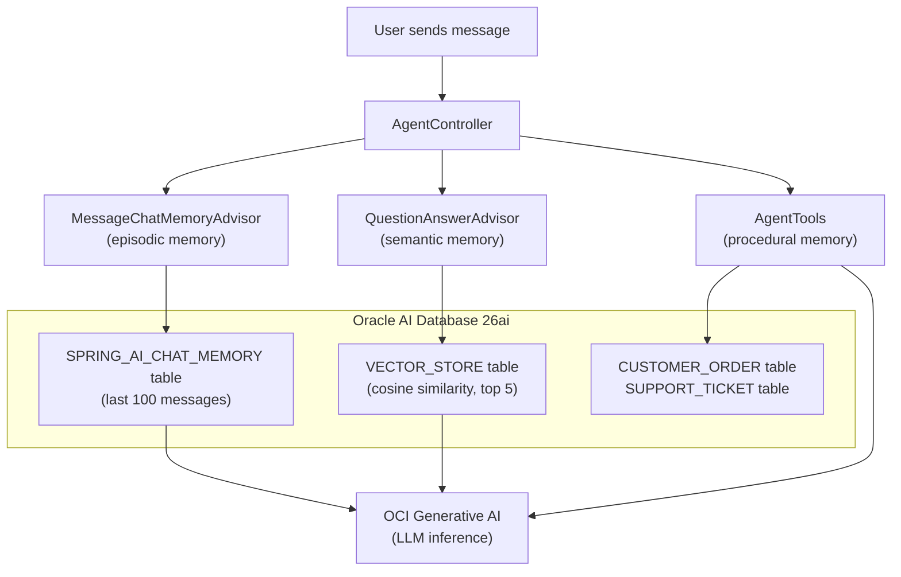
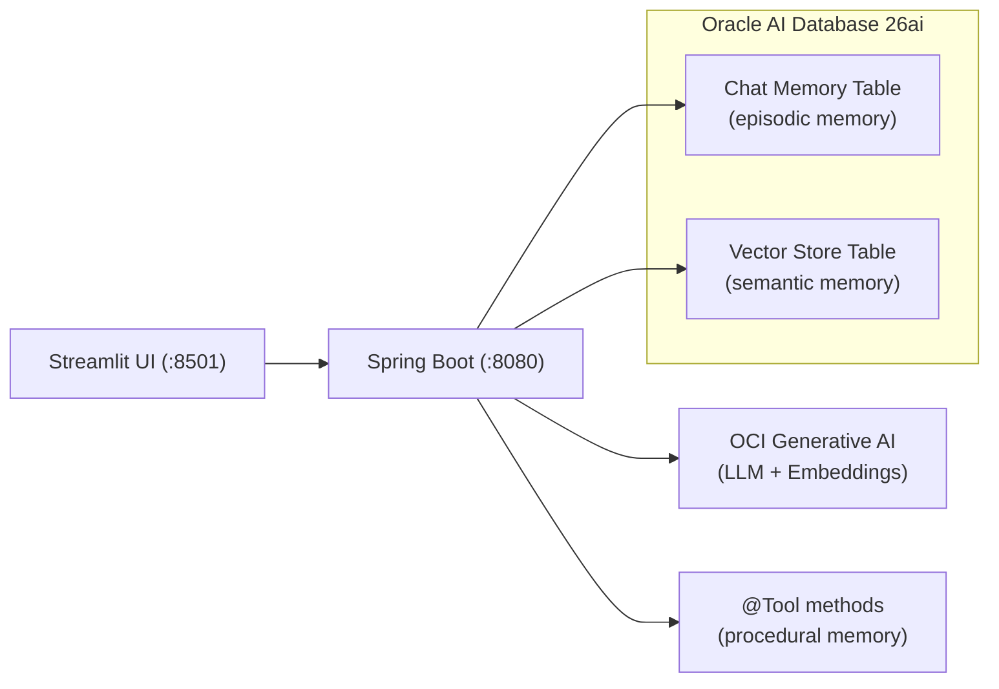

# How I Gave an AI Agent Memory Using Spring AI and Oracle Database

Every LLM has the same problem: it forgets everything the moment the conversation ends. Spend twenty minutes explaining your project setup, your constraints, your preferences -- and it nails the answer. Close the tab, open a new session, and it greets you like a stranger. All that context, gone.

If you want to build an AI *agent* -- something that actually remembers context and knows things about your domain -- you need to give it memory. The practical kind, where it actually remembers what you said and can look up facts you taught it.

This is a POC I built to do exactly that. Three types of memory, one database, a few hundred lines of Java.

## Three Kinds of Memory

People talk about episodic, semantic, procedural, and working memory for agents. I implemented three of them:

**Episodic memory** is chat history. The agent remembers what you said earlier in the conversation. "My name is Alice" at message 1 means it still knows your name at message 50. This is stored as rows in a relational table.

**Semantic memory** is domain knowledge. You feed the agent facts -- product docs, company policies, whatever -- and it retrieves relevant ones when answering questions. This is RAG (Retrieval-Augmented Generation): text gets embedded into vectors, stored in a vector store, and retrieved by similarity search at query time.

**Procedural memory** is the "how" -- the step-by-step workflows the agent knows how to execute. Looking up an order, initiating a return, escalating to support. In Spring AI, these are `@Tool`-annotated methods that the LLM can call when it decides a task requires action, not just an answer.



Both tables live in the same Oracle Database. No Pinecone. No Redis. No second database. One connection pool, one set of credentials, one thing to monitor.

## The Architecture



The stack:

- **Spring Boot 3.5.11** + **Spring AI 1.1.2** for the backend
- **OCI Generative AI** for chat inference and embeddings (Cohere embed-english-light-v2.0)
- **Oracle AI Database 26ai** for both memory tables (with Oracle AI Vector Search for the semantic side)
- **Streamlit** for a quick-and-dirty web UI
- **Java 21**, **Gradle 8.14**

## The Procedural Memory (Tools)

Before we look at the controller, let's see the tools. Procedural memory is implemented as `@Tool`-annotated methods in a Spring component that query real database tables:

```java
@Component
public class AgentTools {

    private final OrderRepository orderRepository;
    private final SupportTicketRepository supportTicketRepository;

    public AgentTools(OrderRepository orderRepository,
                      SupportTicketRepository supportTicketRepository) {
        this.orderRepository = orderRepository;
        this.supportTicketRepository = supportTicketRepository;
    }

    @Tool(description = "List all customer orders.")
    public String listOrders() {
        List<CustomerOrder> orders = orderRepository.findAll();
        // format and return order list
    }

    @Tool(description = "Look up the status of a customer order by its order ID. " +
            "Returns the current status including shipping information.")
    public String lookupOrderStatus(
            @ToolParam(description = "The order ID to look up, e.g. ORD-1001") String orderId) {
        Optional<CustomerOrder> opt = orderRepository.findByOrderId(orderId);
        // return full order details or "not found"
    }

    @Tool(description = "Initiate a product return for a given order. " +
            "Validates the order exists, checks that it is in DELIVERED status, " +
            "and verifies the return is within the 30-day return window.")
    public String initiateReturn(
            @ToolParam(description = "The order ID to return") String orderId,
            @ToolParam(description = "The reason for the return") String reason) {
        // validates DELIVERED status + 30-day window, sets status to PREPARING_RETURN
    }

    @Tool(description = "Escalate an issue to a human support agent. " +
            "Creates a support ticket in the system.")
    public String escalateToSupport(
            @ToolParam(description = "Brief description of the issue") String issue,
            @ToolParam(description = "Priority level: low, medium, or high") String priority,
            @ToolParam(description = "The related order ID, if applicable.") String orderId) {
        SupportTicket ticket = new SupportTicket(orderId, issue, priority.toUpperCase());
        supportTicketRepository.save(ticket);
        // return ticket ID + ETA
    }

    @Tool(description = "List all support tickets.")
    public String listSupportTickets() {
        List<SupportTicket> tickets = supportTicketRepository.findAll();
        // format and return ticket list
    }
}
```

Each method encodes a procedure the agent knows how to execute. The `@Tool` description tells the LLM *when* to use it, and `@ToolParam` describes what arguments to pass. When the user says "I want to return order ORD-1001," the LLM reads the tool descriptions, decides `initiateReturn` is the right procedure, extracts the arguments from the conversation, calls the method, and incorporates the result into its response.

The tools query real JPA entities (`CustomerOrder`, `SupportTicket`) backed by Oracle Database tables. `initiateReturn` validates that the order is in DELIVERED status and within the 30-day return window before changing its status. `escalateToSupport` creates a persistent ticket. The LLM decides *when* to act; the Java methods define *how*.

## The Controller

The controller wires everything together. Here it is, slightly trimmed:

```java
@RestController
@RequestMapping("/api/v1/agent")
public class AgentController {

    private final ChatClient chatClient;
    private final VectorStore vectorStore;

    public AgentController(ChatClient.Builder builder,
                           JdbcChatMemoryRepository chatMemoryRepository,
                           VectorStore vectorStore,
                           AgentTools agentTools) {
        this.vectorStore = vectorStore;

        ChatMemory chatMemory = MessageWindowChatMemory.builder()
                .chatMemoryRepository(chatMemoryRepository)
                .maxMessages(100)
                .build();

        this.chatClient = builder
                .defaultSystem("""
                        You are a helpful AI assistant with access to a knowledge base \
                        and a set of tools for performing tasks. \
                        When answering questions, use any relevant context provided to you. \
                        When a user asks you to perform an action (like looking up an order, \
                        initiating a return, or escalating to support), use the appropriate tool. \
                        If you don't know the answer, say so honestly. \
                        Be concise and direct in your responses.""")
                .defaultTools(agentTools)
                .defaultAdvisors(
                        MessageChatMemoryAdvisor.builder(chatMemory).build(),
                        QuestionAnswerAdvisor.builder(vectorStore)
                                .searchRequest(SearchRequest.builder()
                                        .topK(5)
                                        .similarityThreshold(0.7)
                                        .build())
                                .build()
                )
                .build();
    }

    @PostMapping("/chat")
    public ResponseEntity<String> chat(
            @RequestBody String message,
            @RequestHeader("X-Conversation-Id") String conversationId) {
        // validation omitted for brevity
        String response = chatClient.prompt()
                .user(message)
                .advisors(a -> a.param(ChatMemory.CONVERSATION_ID, conversationId))
                .call()
                .content();
        return ResponseEntity.ok(response);
    }

    @PostMapping("/knowledge")
    public ResponseEntity<String> addKnowledge(@RequestBody String content) {
        // validation omitted for brevity
        vectorStore.add(List.of(new Document(content)));
        return ResponseEntity.ok("Knowledge added.");
    }
}
```

Two endpoints, two advisors, five tools, one `ChatClient`. Let's break down the three memory types.

### Episodic Memory (Advisors)

Spring AI's advisor pattern is where the magic lives. Advisors intercept every call to the LLM and can modify the prompt before it goes out and process the response when it comes back.

**`MessageChatMemoryAdvisor`** handles episodic memory. Before each LLM call, it loads the last 100 messages for the current conversation from the `SPRING_AI_CHAT_MEMORY` table and prepends them to the prompt. After the response, it saves the new exchange. The conversation is identified by the `X-Conversation-Id` header -- different ID, different memory.

### Semantic Memory (RAG)

**`QuestionAnswerAdvisor`** handles semantic memory. Before each LLM call, it takes the user's question, runs a cosine similarity search against the vector store (top 5 results, 0.7 threshold), and injects any matching documents into the prompt as context. This is the RAG part -- the agent can answer questions about things you've taught it via the `/knowledge` endpoint.

### Procedural Memory (Tools)

**`AgentTools`** handles procedural memory. The `.defaultTools(agentTools)` call registers all five `@Tool`-annotated methods from the component. On every request, the LLM receives the tool descriptions alongside the user's message. If the task requires action -- not just knowledge retrieval -- the LLM calls the appropriate tool, gets the result, and weaves it into its response. Spring AI handles the tool-calling protocol automatically.

All three memory types run on every request. The agent simultaneously remembers what you said, looks up relevant knowledge, and knows how to perform tasks.

### The Knowledge Endpoint

The `/knowledge` endpoint is simple: POST some text, it gets wrapped in a `Document`, embedded into a vector (via OCI's Cohere embedding model), and stored in Oracle's vector store table. Next time someone asks a related question, the `QuestionAnswerAdvisor` will find it.

### Seed Data

A `DataSeeder` (Spring `CommandLineRunner`) populates the database on startup with 8 demo orders and 3 policy documents (return, shipping, support policies). Orders use relative dates so the 30-day return window logic always works for demo purposes. The seeder checks if orders already exist to avoid duplicates on restarts.

## The Configuration

Most of the work is in `application.yaml`:

```yaml
spring:
  jpa:
    hibernate:
      ddl-auto: update

  datasource:
    url: ${DB_URL:jdbc:oracle:thin:@//localhost:1521/freepdb1}
    username: ${DB_USERNAME:spring_ai_user}
    password: ${DB_PASSWORD}
    driver-class-name: oracle.jdbc.OracleDriver
    type: oracle.ucp.jdbc.PoolDataSourceImpl
    oracleucp:
      initial-pool-size: 5
      min-pool-size: 5
      max-pool-size: 20

  ai:
    oci:
      genai:
        chat:
          options:
            model: ${OCI_GENAI_MODEL}
            compartment: ${OCI_COMPARTMENT}
            serving-mode: on-demand
            temperature: 0.7
            max-tokens: 2048
        embedding:
          model: ${OCI_EMBEDDING_MODEL:cohere.embed-english-light-v2.0}
          compartment: ${OCI_COMPARTMENT}

    vectorstore:
      oracle:
        initialize-schema: true
        distance-type: COSINE
        dimensions: 384

    chat:
      memory:
        repository:
          jdbc:
            initialize-schema: always
```

A few things worth noting:

- **`ddl-auto: update`** lets Hibernate create the `CUSTOMER_ORDER` and `SUPPORT_TICKET` tables automatically. Combined with Spring AI's **`initialize-schema: true/always`** for the `SPRING_AI_CHAT_MEMORY` and vector store tables, there are no SQL scripts or Flyway migrations needed.
- **384 dimensions** matches the Cohere embed-english-light-v2.0 model's output. If you swap the embedding model, change this number.
- **Oracle UCP** (Universal Connection Pool) handles connection pooling. It's configured as the datasource type, so both the chat memory JDBC queries and the vector store operations share the same pool.
- **COSINE** distance is the standard choice for text similarity.

There's no custom `@Configuration` class for the chat memory beans. Spring AI's auto-configuration detects the Oracle JDBC driver and sets up `JdbcChatMemoryRepository` with the right SQL dialect automatically. The article in `docs/article.md` shows a manual `OracleChatMemoryConfig` class -- you don't need it.

## The Web UI (50 Lines of Python)

The Streamlit frontend is intentionally minimal:

```python
import os, uuid, requests, streamlit as st

st.title("Chat")
backend_url = st.sidebar.text_input("Backend URL",
    value=os.getenv("BACKEND_URL", "http://localhost:8080"))

if "conversation_id" not in st.session_state:
    st.session_state.conversation_id = str(uuid.uuid4())
if "messages" not in st.session_state:
    st.session_state.messages = []

for msg in st.session_state.messages:
    with st.chat_message(msg["role"]):
        st.markdown(msg["content"])

if prompt := st.chat_input("Type a message..."):
    st.session_state.messages.append({"role": "user", "content": prompt})
    with st.chat_message("user"):
        st.markdown(prompt)
    with st.chat_message("assistant"):
        with st.spinner("Thinking..."):
            resp = requests.post(
                f"{backend_url.rstrip('/')}/api/v1/agent/chat",
                data=prompt,
                headers={"Content-Type": "text/plain",
                         "X-Conversation-Id": st.session_state.conversation_id},
                timeout=120)
            resp.raise_for_status()
            answer = resp.text
        st.markdown(answer)
    st.session_state.messages.append({"role": "assistant", "content": answer})
```

It generates a UUID per session for the conversation ID, sends plain text to the backend, and renders the response. That's it.

## Running It Yourself

### 1. Start Oracle Database

```bash
podman run -d --name oradb \
  -p 1521:1521 \
  -e ORACLE_PWD=Oracle123 \
  -v ./oradata:/opt/oracle/oradata \
  container-registry.oracle.com/database/free:latest
podman logs -f oradb
```

Wait for "DATABASE IS READY TO USE!" in the logs before continuing.

### 2. Set OCI credentials

```bash
export OCI_GENAI_MODEL=<your-model-ocid>
export OCI_COMPARTMENT=<your-compartment-ocid>
```

You'll need an OCI account with access to Generative AI. Auth defaults to `~/.oci/config` with the `DEFAULT` profile.

### 3. Start the backend

```bash
cd src/chatserver
./gradlew bootRun --args='--spring.profiles.active=local'
```

The `local` profile uses the `PDBADMIN` user that already exists in the Oracle Free container -- no database setup needed.

### 4. Start the UI

```bash
cd src/web
pip install -r requirements.txt
streamlit run app.py
```

### 5. Or just use curl

Chat with the agent:

```bash
curl -X POST http://localhost:8080/api/v1/agent/chat \
  -H "Content-Type: text/plain" \
  -H "X-Conversation-Id: test-1" \
  -d "Hello, what can you help me with?"
```

Ask about policies (semantic memory -- policies are auto-seeded on startup):

```bash
curl -X POST http://localhost:8080/api/v1/agent/chat \
  -H "Content-Type: text/plain" \
  -H "X-Conversation-Id: test-1" \
  -d "What's your return policy?"
```

Use procedural memory (the agent calls the right tool automatically):

```bash
curl -X POST http://localhost:8080/api/v1/agent/chat \
  -H "Content-Type: text/plain" \
  -H "X-Conversation-Id: test-1" \
  -d "What orders do I have?"
```

```bash
curl -X POST http://localhost:8080/api/v1/agent/chat \
  -H "Content-Type: text/plain" \
  -H "X-Conversation-Id: test-1" \
  -d "Can you check the status of order ORD-1001?"
```

```bash
curl -X POST http://localhost:8080/api/v1/agent/chat \
  -H "Content-Type: text/plain" \
  -H "X-Conversation-Id: test-1" \
  -d "I want to return that order, the product was defective."
```

## What This Is (and Isn't)

This is a proof of concept. It demonstrates that you can give an AI agent three types of persistent memory using Spring AI and Oracle Database with very little code. Two advisors handle episodic and semantic memory; `@Tool` methods handle procedural memory.

What it isn't:

- **Not production-hardened.** There's no authentication, no rate limiting, no streaming responses.
- **Not Oracle-exclusive.** Spring AI's abstractions are vendor-neutral. You could swap Oracle for PostgreSQL + pgvector and the controller code wouldn't change. Oracle is what I used because it handles the relational chat history, the vector store, and the order/ticket tables all in one database, and Oracle AI Vector Search works well for this use case.

The whole point is that agent memory doesn't have to be complicated. Two advisors, five tools backed by real database tables, seed data, one database, and the LLM stops forgetting.

---

**Stack:** Spring Boot 3.5.11 | Spring AI 1.1.2 | Java 21 | Oracle AI Database 26ai | OCI Generative AI | Streamlit

**Code:** [github.com/victormartin/oracle-database-java-agent-memory](.)
