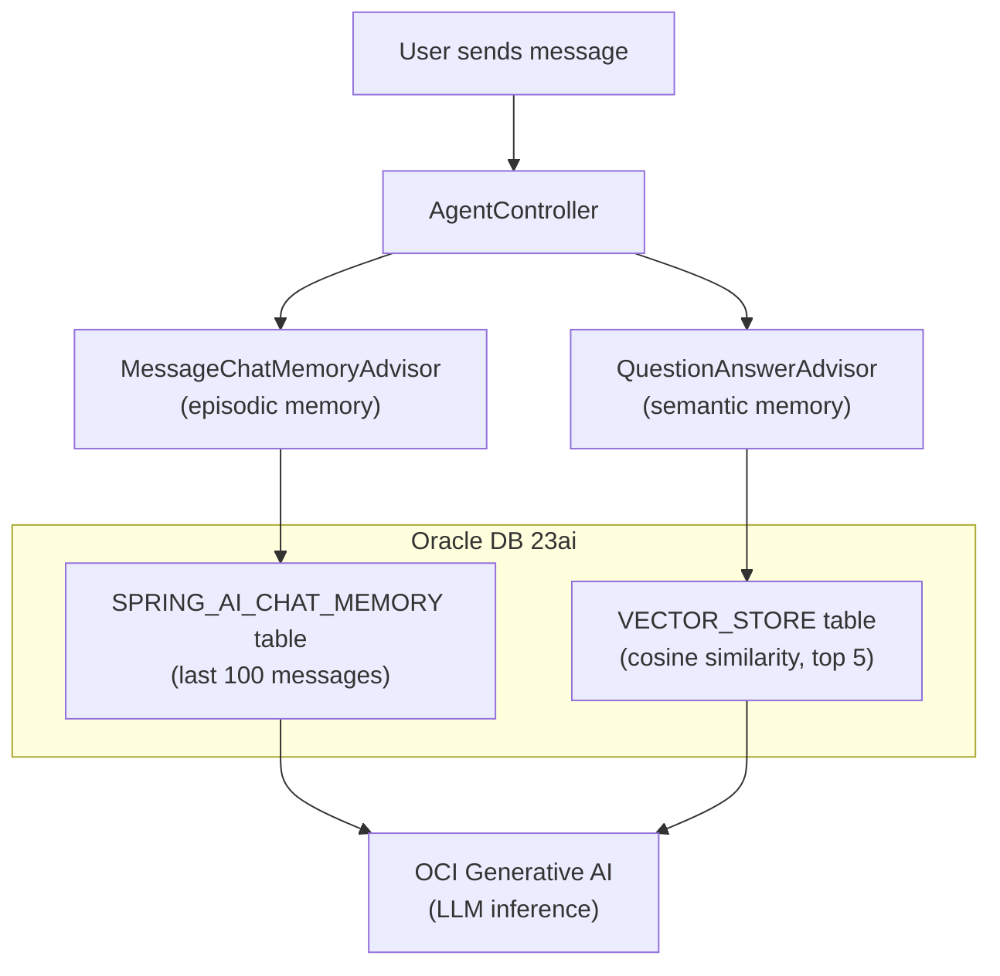
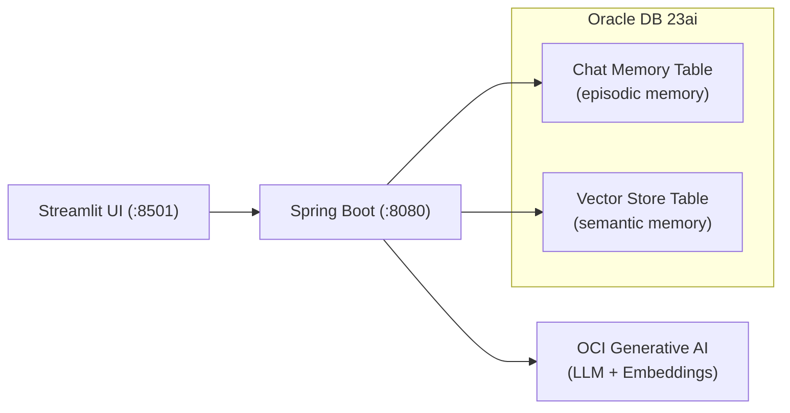

# How I Gave an AI Agent Memory Using Spring AI and Oracle Database

Every LLM has the same problem: it forgets everything the moment the conversation ends. Ask it your name, tell it your name, ask again in a new session -- gone. It's like talking to someone with a very expensive case of amnesia.

If you want to build an AI *agent* -- something that actually remembers context and knows things about your domain -- you need to give it memory. Not the marketing-deck kind of memory with five architecture layers and a Kubernetes diagram. The practical kind, where the thing actually remembers what you said and can look up facts you taught it.

This is a POC I built to do exactly that. Two types of memory, one database, about 100 lines of Java.

## Two Kinds of Memory (and Only Two)

There's a taxonomy of agent memory floating around that includes episodic, semantic, procedural, and working memory. I implemented two of them because two is enough:

**Episodic memory** is chat history. The agent remembers what you said earlier in the conversation. "My name is Alice" at message 1 means it still knows your name at message 50. This is stored as rows in a relational table.

**Semantic memory** is domain knowledge. You feed the agent facts -- product docs, company policies, whatever -- and it retrieves relevant ones when answering questions. This is RAG (Retrieval-Augmented Generation): text gets embedded into vectors, stored in a vector store, and retrieved by similarity search at query time.



Both tables live in the same Oracle Database. No Pinecone. No Redis. No second database. One connection pool, one set of credentials, one thing to monitor.

## The Architecture



The stack:

- **Spring Boot 3.5.11** + **Spring AI 1.1.2** for the backend
- **OCI Generative AI** for chat inference and embeddings (Cohere embed-english-light-v2.0)
- **Oracle Database 23ai** for both memory tables (with Oracle AI Vector Search for the semantic side)
- **Streamlit** for a quick-and-dirty web UI
- **Java 21**, **Gradle 8.14**

## The Controller (the Whole Thing)

The entire agent is one file. Here it is, slightly trimmed for the blog but structurally identical to the real thing:

```java
@RestController
@RequestMapping("/api/v1/agent")
public class AgentController {

    private final ChatClient chatClient;
    private final VectorStore vectorStore;

    public AgentController(ChatClient.Builder builder,
                           JdbcChatMemoryRepository chatMemoryRepository,
                           VectorStore vectorStore) {
        this.vectorStore = vectorStore;

        ChatMemory chatMemory = MessageWindowChatMemory.builder()
                .chatMemoryRepository(chatMemoryRepository)
                .maxMessages(100)
                .build();

        this.chatClient = builder
                .defaultSystem("""
                        You are a helpful AI assistant with access to a knowledge base. \
                        When answering questions, use any relevant context provided to you. \
                        If you don't know the answer, say so honestly. \
                        Be concise and direct in your responses.""")
                .defaultAdvisors(
                        MessageChatMemoryAdvisor.builder(chatMemory).build(),
                        QuestionAnswerAdvisor.builder(vectorStore)
                                .searchRequest(SearchRequest.builder()
                                        .topK(5)
                                        .similarityThreshold(0.7)
                                        .build())
                                .build()
                )
                .build();
    }

    @PostMapping("/chat")
    public ResponseEntity<String> chat(
            @RequestBody String message,
            @RequestHeader("X-Conversation-Id") String conversationId) {
        // validation omitted for brevity
        String response = chatClient.prompt()
                .user(message)
                .advisors(a -> a.param(ChatMemory.CONVERSATION_ID, conversationId))
                .call()
                .content();
        return ResponseEntity.ok(response);
    }

    @PostMapping("/knowledge")
    public ResponseEntity<String> addKnowledge(@RequestBody String content) {
        // validation omitted for brevity
        vectorStore.add(List.of(new Document(content)));
        return ResponseEntity.ok("Knowledge added.");
    }
}
```

That's the whole agent. Two endpoints, two advisors, one `ChatClient`. Let's break down what's happening.

### The Two Advisors

Spring AI's advisor pattern is where the magic lives. Advisors intercept every call to the LLM and can modify the prompt before it goes out and process the response when it comes back. The controller wires two of them:

**`MessageChatMemoryAdvisor`** handles episodic memory. Before each LLM call, it loads the last 100 messages for the current conversation from the `SPRING_AI_CHAT_MEMORY` table and prepends them to the prompt. After the response, it saves the new exchange. The conversation is identified by the `X-Conversation-Id` header -- different ID, different memory.

**`QuestionAnswerAdvisor`** handles semantic memory. Before each LLM call, it takes the user's question, runs a cosine similarity search against the vector store (top 5 results, 0.7 threshold), and injects any matching documents into the prompt as context. This is the RAG part -- the agent can answer questions about things you've taught it via the `/knowledge` endpoint.

Both advisors run on every request. The agent simultaneously remembers what you said earlier *and* looks up relevant domain knowledge. No custom code needed beyond wiring them in the constructor.

### The Knowledge Endpoint

The `/knowledge` endpoint is simple: POST some text, it gets wrapped in a `Document`, embedded into a vector (via OCI's Cohere embedding model), and stored in Oracle's vector store table. Next time someone asks a related question, the `QuestionAnswerAdvisor` will find it.

## The Configuration

Most of the work is in `application.yaml`:

```yaml
spring:
  datasource:
    url: ${DB_URL:jdbc:oracle:thin:@//localhost:1521/freepdb1}
    username: ${DB_USERNAME:spring_ai_user}
    password: ${DB_PASSWORD}
    driver-class-name: oracle.jdbc.OracleDriver
    type: oracle.ucp.jdbc.PoolDataSourceImpl
    oracleucp:
      initial-pool-size: 5
      min-pool-size: 5
      max-pool-size: 20

  ai:
    oci:
      genai:
        chat:
          options:
            model: ${OCI_GENAI_MODEL}
            compartment: ${OCI_COMPARTMENT}
            serving-mode: on-demand
            temperature: 0.7
            max-tokens: 2048
        embedding:
          model: ${OCI_EMBEDDING_MODEL:cohere.embed-english-light-v2.0}
          compartment: ${OCI_COMPARTMENT}

    vectorstore:
      oracle:
        initialize-schema: true
        distance-type: COSINE
        dimensions: 384

    chat:
      memory:
        repository:
          jdbc:
            initialize-schema: always
```

A few things worth noting:

- **`initialize-schema: true/always`** means Spring AI creates the `SPRING_AI_CHAT_MEMORY` and vector store tables automatically on startup. No SQL scripts, no Flyway migrations.
- **384 dimensions** matches the Cohere embed-english-light-v2.0 model's output. If you swap the embedding model, change this number.
- **Oracle UCP** (Universal Connection Pool) handles connection pooling. It's configured as the datasource type, so both the chat memory JDBC queries and the vector store operations share the same pool.
- **COSINE** distance is the standard choice for text similarity.

There's no custom `@Configuration` class for the chat memory beans. Spring AI's auto-configuration detects the Oracle JDBC driver and sets up `JdbcChatMemoryRepository` with the right SQL dialect automatically. The article in `docs/article.md` shows a manual `OracleChatMemoryConfig` class -- you don't need it.

## The Web UI (50 Lines of Python)

The Streamlit frontend is intentionally minimal:

```python
import os, uuid, requests, streamlit as st

st.title("Chat")
backend_url = st.sidebar.text_input("Backend URL",
    value=os.getenv("BACKEND_URL", "http://localhost:8080"))

if "conversation_id" not in st.session_state:
    st.session_state.conversation_id = str(uuid.uuid4())
if "messages" not in st.session_state:
    st.session_state.messages = []

for msg in st.session_state.messages:
    with st.chat_message(msg["role"]):
        st.markdown(msg["content"])

if prompt := st.chat_input("Type a message..."):
    st.session_state.messages.append({"role": "user", "content": prompt})
    with st.chat_message("user"):
        st.markdown(prompt)
    with st.chat_message("assistant"):
        with st.spinner("Thinking..."):
            resp = requests.post(
                f"{backend_url.rstrip('/')}/api/v1/agent/chat",
                data=prompt,
                headers={"Content-Type": "text/plain",
                         "X-Conversation-Id": st.session_state.conversation_id},
                timeout=120)
            resp.raise_for_status()
            answer = resp.text
        st.markdown(answer)
    st.session_state.messages.append({"role": "assistant", "content": answer})
```

It generates a UUID per session for the conversation ID, sends plain text to the backend, and renders the response. That's it.

## Running It Yourself

### 1. Start Oracle Database

```bash
podman run -d --name oradb \
  -p 1521:1521 \
  -e ORACLE_PWD=Oracle123 \
  -v ./oradata:/opt/oracle/oradata \
  container-registry.oracle.com/database/free:latest

# Wait for "DATABASE IS READY TO USE!"
podman logs -f oradb
```

### 2. Set OCI credentials

```bash
export OCI_GENAI_MODEL=<your-model-ocid>
export OCI_COMPARTMENT=<your-compartment-ocid>
```

You'll need an OCI account with access to Generative AI. Auth defaults to `~/.oci/config` with the `DEFAULT` profile.

### 3. Start the backend

```bash
cd src/chatserver
./gradlew bootRun --args='--spring.profiles.active=local'
```

The `local` profile uses the `PDBADMIN` user that already exists in the Oracle Free container -- no database setup needed.

### 4. Start the UI

```bash
cd src/web
pip install -r requirements.txt
streamlit run app.py
```

### 5. Or just use curl

```bash
# Chat
curl -X POST http://localhost:8080/api/v1/agent/chat \
  -H "Content-Type: text/plain" \
  -H "X-Conversation-Id: test-1" \
  -d "Hello, what can you help me with?"

# Teach it something
curl -X POST http://localhost:8080/api/v1/agent/knowledge \
  -H "Content-Type: text/plain" \
  -d "The company's return policy allows returns within 30 days of purchase."

# Ask about what you taught it
curl -X POST http://localhost:8080/api/v1/agent/chat \
  -H "Content-Type: text/plain" \
  -H "X-Conversation-Id: test-1" \
  -d "What's the return policy?"
```

## What This Is (and Isn't)

This is a proof of concept. It demonstrates that you can give an AI agent persistent episodic and semantic memory using Spring AI and Oracle Database with very little code. The advisor pattern does the heavy lifting -- you wire two advisors and get chat history + RAG for free.

What it isn't:

- **Not production-hardened.** There's no authentication, no rate limiting, no streaming responses.
- **Not a full memory architecture.** Procedural memory (learned workflows) and working memory (active scratchpad) aren't implemented. They're interesting concepts, but this POC didn't need them.
- **Not Oracle-exclusive.** Spring AI's abstractions are vendor-neutral. You could swap Oracle for PostgreSQL + pgvector and the controller code wouldn't change. Oracle is what I used because it handles both the relational chat history and the vector store in one database, and Oracle AI Vector Search works well for this use case.

The whole point is that agent memory doesn't have to be complicated. Two advisors, one database, and the LLM stops forgetting.

---

**Stack:** Spring Boot 3.5.11 | Spring AI 1.1.2 | Java 21 | Oracle Database 23ai | OCI Generative AI | Streamlit

**Code:** [github.com/victormartin/oracle-database-java-agent-memory](.)
